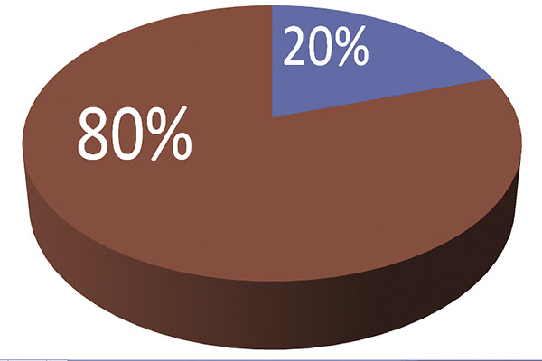

## Sobre el curso de Python

El curso consta de una serie de lecciones con sus vídeos más unos apéndices que si bien no son necesarios para aprender a programar, pueden resultar interesantes.

En una primera lectura del curso puedes prescindir de los apéndices.

Python es un lenguaje tan extenso y tan utilizado que un curso que pretendiera ser "completo" sería inabarcable.

Por eso en este curso vamos a tratar las características de Python que te permiten resolver el 80% de los problemas, dejando para un curso posterior, más avanzado ese 20% que nos llevaría mucho más tiempo explicar y aprender ([principio de Pareto o la regla 80-20](https://es.wikipedia.org/wiki/Principio_de_Pareto)).

Por eso decimos que el curso empieza desde cero y llega hasta un nivel intermedio, dejando el resto para un curso avanzado que se presentará próximamente.

Para ellos vamos a utilizar muchos ejemplos concretos para cada punto y algunos proyectos más extensos que iremos construyendo a lo largo del curso.

### Índice

Veamos un índice detallado:

0. Introducción
    * Historia 
    * Versiones 
    * Evolución
    * Usos y aplicaciones

1. Instalación y primeras pruebas
    * 1ª instalación 
    * La consola y Hello Python
    * Entornos de desarrollo

2. Primeros ejemplos
    * Nuestro código en ficheros
    * 1er programa: Hola Python
    * Normas de escritura de código en Python: formato, comentarios, ...
    * Diferencias con otros lenguajes

3. Variables, tipos y operaciones 
    * Variables
    * Manejo de números
    * Operadores aritméticos
    * Tipos
    * Conversiones entre tipos
    * Entrada de datos
    * Excepciones y errores

4. Sentencias condicionales y operadores
    * Sentencias condicionales
    * Operadores lógicos
    * Operadores relacionales

5. Bucles e iteraciones 
    * Bucle while
    * Iteración sobre listas
    * Bucle for
    * Excepciones y errores
    * Ejemplos

6. Trabajando con funciones
    * Qué es una función
    * Ejemplos de uso
    * Todo está lleno de funciones en Python...
    * Depuración en funciones
    * Variables globales y locales
    * Funciones recursivas
    * Ejemplos

7. Colecciones: Listas, tuplas y diccionarios
    * Listas
    * Tuplas
    * Diccionarios
    * Diferencias y usos de cada
    * Excepciones y errores
    * Ejemplos: 
        * Generador de jerga técnica (BuzzWords)
        * Cálculo de retenciones IRPF
        * Juego de las 20 preguntas

8. Trabajando con ficheros
    * Administración y gestión de ficheros
    * Lectura de ficheros
    * Escritura de ficheros
    * Excepciones y errores
    * Procesamiento de cadenas (strings)
    * Ejemplo: 
        * WordCounter - contador de palabras, líneas y caracteres
        * Juego de las 20 preguntas v2

9. Clases y Programación Orientada a Objetos (POO)
    * Qué es una clase. 
    * OOP:Paradigma de programación orientada a objetos
    * Herencia
    * Clases en Python y su utilidad
    * Ejemplos:
        * Juego de las 20 preguntas v3

10. Módulos y librerías
    * Qué es un módulo
    * Librería estándar de Python
    * Instalación de módulos
    * Usando Jupyter Notebook
    * Dónde encontrarlos
    * Gráficas con Python: matplotlib
    * Trabajando con ficheros csv: pandas
    * Ejemplos: 
        * Bot de Telegram
        * Representaciones Gráficas

11. Dibujando y jugando con pygame
    * Instalación de pygame
    * Dibujos sencillos
    * Programas interactivos
    * Pequeños juegos
        * Juego de la vida
        * Memory

12. Servidores web 
    * Introducción a los servicios y servidores Web
    * Servidor sencillo con Flask
    * Servicios Web
    * Errores y excepciones
    * Ejemplos sencillos

[Vídeo: Presentación del curso y los contenidos](https://drive.google.com/file/d/19_HOjvBFcFISSqkzCTEjsmwAPOjj_TzE/view?usp=sharing)

