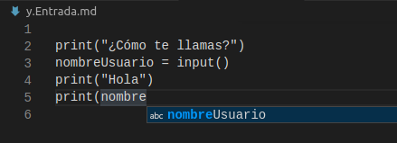

## Instalación

Descargamos desde www.python.org/downloads la versión 3.x

En windows no debemos olvidar marcar la opción de "Añadir python al Path"


En linux suele venir instalado por defecto

Si tenemos también instalada la versión 2 podemos ejecutar la 3 con 
python3


ejecutamos 

```
python
```

y nos aparecerá la versión

para salir escribimos **quit()** y pulsamos la tecla **Enter**

## IDE vs editores

Dado que python es interpretado, para crear un programa solo necesitamos un editor de texto, pero para programar en serio debemos usar un IDE

Un IDE es un Entorno Integrado de Desarrollo y nos aporta ventajas y herramientas que nos facilitan el desarrollo como: correctores, escritura predictiva, depuradores, plantillas, etc.



Ejemplo de escritura predictiva donde el IDE nos muestra las posiblidades para ahorrarnos tener que escribir toda la sentencia

### pyCharm

Es un IDE profesional que dispone de una versión gratuita (con menos opciones)

### pyDev

Es un IDE gratuito

### [Visual Studio Code](./1.2.VSCode.md)


### mu-editor

Es un algo más que un editor pero menos que un IDE

Está escrito en python

En Ubuntu podemos instalarlo haciendo

```
sudo pip3 install mu-editor
```


### [Thonny](./1.3.Thonny.md)

## Otros Editores

### Atom

### Sublime Text

También es de pago pero con una versión gratuita con anuncios


## Referencias

[Diferentes IDEs](https://www.kdnuggets.com/2021/01/best-python-ide-code-editors.html)

[Instalacion](https://www.youtube.com/watch?v=9HPf0UE1s2U)