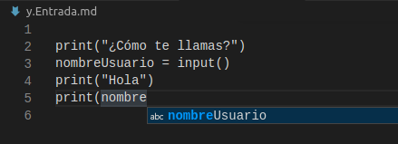

# Primera instalacion y Hola Python

Ya que estamos convencidos de la utilidad de Python, vamos a comenzar con su instalación.

Tenemos 2 alternativas:

* Instalar **sólo** el intérprete y usar cualquier editor de texto puro (no vale un Word o similar porque introducen caracteres de formato y el resultado no lo entendería el intérprete) para escribir nuestros programas, o
* Instalar un Entorno de desarrollo integrado (IDE) que nos facilite el trabajo. Para empezar a programar en serio debemos usar un IDE, que nos aporta ventajas y herramientas que nos facilitan el desarrollo como: correctores, escritura predictiva, depuradores, plantillas, etc.

    

Ejemplo de escritura predictiva donde el IDE nos muestra las posiblidades para ahorrarnos tener que escribir toda la sentencia, ahorrando tiempo y evitando errores.

Salvo que seas un fanático de la consola de comandos o sólo puedas acceder a tu ordenador remotamente y sin escritorio visual, la mejor opción ahora mismos sería un IDE ligero y con la funcionalidad esencial.

Vamos a empezar usando un IDE sencillo, Thonny, que tiene todo lo necesario, pero que no nos abruma con un excesivo número de menús, ni de opciones que no necesitamos.

A lo largo del curso iremos instalando y aprendiendo a usar otros IDEs más avanzados, a medida que los vayamos necesitando.

Son muchos los IDEs disponibles veamos algunos ellos

### [PyCharm](https://www.jetbrains.com/es-es/pycharm/)

A día de hoy es el que más se una a nivel profesional para trabajar con Python. Al ser la opción profesional es de pago y dispone de una versión gratuita (con menos opciones). 

### [PyDev](https://www.pydev.org/)

Es un complemento para el entorno Eclipse para programar Python y por tanto es gratuito un IDE gratuito.

### [Visual Studio Code](./1.2.VSCode.md)

Es un excelente IDE multilenguaje, multientorno y con miles de complementos de Microsoft. Al ser multilenguaje es una elección natural para los que trabajamos con varios lenguajes. 

En mi caso lo uso para trabajar con Arduino, Python y para editar documentación (todo el material de este curso está editado con él). 

Es mi elección para el desarrollador con manejo del lenguaje y de las herramientas, pero quizás un poco dificil para empezar. Lo usaremos a partir de la mitad del curso, cuando los proyectos empiecen a ser más complejos.

### [Jupyter Notebook](https://jupyter.org/)

Jupyter es una aplicación Web (la ejecutamos en local, en nuestra máquina pero sobre un navegador web) diseñada para crear al mismo tiempo documentación y código pensando sobre todo en compartirlo posteriormente.

Como se puede ver en la imagen está muy orientada hacia el mundo científico. La usaremos en los últimos temas del curso, sobre todo para el tema de gráficos, su entorno natural.

### [Mu](https://codewith.mu/)

Es un algo más que un editor pero mucho menos que un IDE. Se puede usar como iniciación, pero enseguida se queda corto. Sí que es cómodo para trabajar sistemas embebidos, tipo micro:bit o ESP32 con Python.

Está escrito en Python, lo cual es un plus.

### Otros Editores

Existen otros editores que admiten complementos para trabajar con Python (y con otros lenguajes) como pueden ser [Atom](https://atom.io/) o [Sublime Text](https://www.sublimetext.com/), este último de  pago pero con una versión gratuita con limitaciones.

### Entornos online

Existen páginas que nos permite trabajar con un interprete de Python (y de más lenguajes) online.

Son cómodos de usar y pueden ayudarnos para resolver algún problema puntual de acceso o para tomar contacto con el sistema.

Uno que funciona especialmente bien y que además incluye multitud de lenguajes y entornos de desarrollo es [replit](https://repl.it/languages/python3), que os recomiendo que probéis

Otra página donde podemos practicar con nuestro código es [create.withcode](https://create.withcode.uk/)
