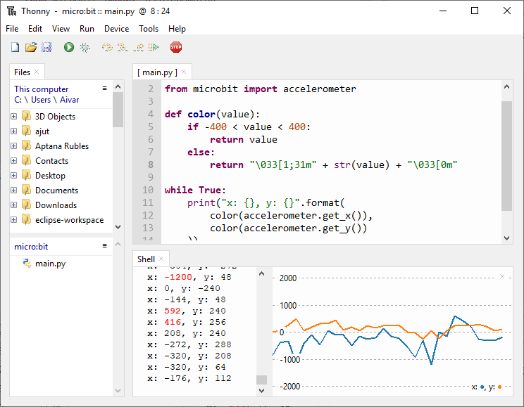
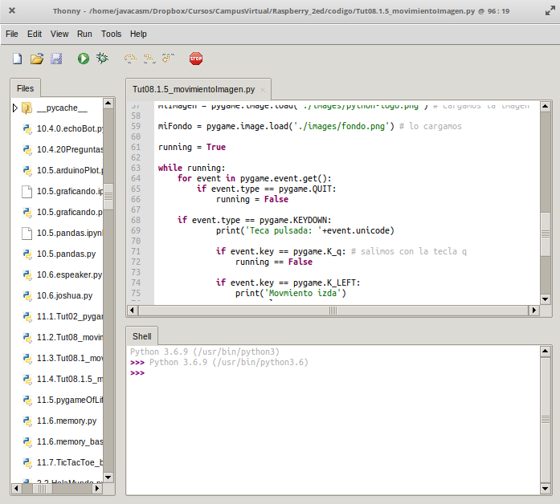
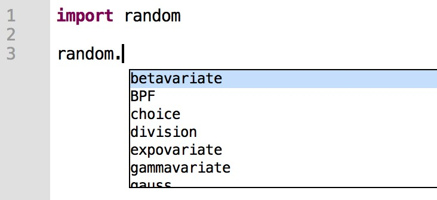
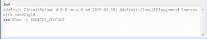
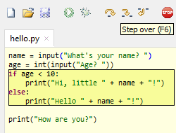
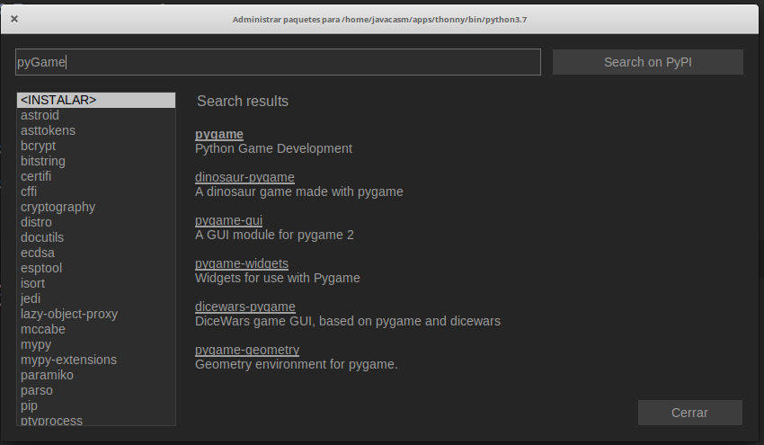
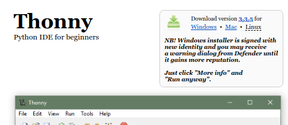

## [Thonny](https://thonny.org/)

[Thonny](https://thonny.org) es un IDE sencillo y ¡está escrito en python! y es Open source. Puedes encontrar [su código fuente en github](https://github.com/thonny/thonny)



El IDE Thonny incluye todo lo necesario para editar y ejecutar nuestros programas, puesto que además de editor incluye el entorno de ejecución de Python. 

Por ello y por su facilidad de uso es la elección para quien empieza.

Thonny incluye las características esenciales para desarrollar en Python:

* **Edición de ficheros**: Podemos editar nuestros ficheros de código. También nos permite gestionar archivos con un explorador de ficheros.

    

* Como vemos **resalta la sintaxis**, lo que nos facilita la lectura.

* También nos ayuda **autocompletando código**, con variables y funciones. Esto nos agiliza la escritura del código y además  evita errores.

    

* En la parte de abajo de la ventana vemos una **consola** que se conoce como **REPL** (Read-Eval–Print Loop) que nos permite trabajar interactivamente con Python

    

* **Depuración**: Podemos ejecutar nuestro programa de forma normal o en modo depuración donde podremos ejecutar línea a línea.

    

* **Visualización de variables y sus valores**: Mientras depuramos también podemos abrir la vista de variables que nos va a permitir seguir el valor que tienen las variables en cada momento.

    

* **Instalación de paquetes y complementos** Desde el propio IDE podemos gestionar e instalar paquetes y complementos, necesarios para nuestros programas.

    


### Instalación

Lo [descargamos de su página](https://thonny.org/)



y lo instalamos siguiendo las instrucciones. 

Como hemos dicho incluye todo lo necesario para ejecutar nuestro código Python.

[Vídeo: Instalación de Thonny en Windows](https://drive.google.com/file/d/1XbKdffA5J6Cxl-TwiLnrw0qX0_ys577o/view?usp=sharing)


En Linux también podemos instalar de esta dos maneras:

```sh
sudo apt instal thonny
```
ó

```sh
pip3 install thonny
```

La segunda nos garantiza que vamos a instalar la última versión disponible.
