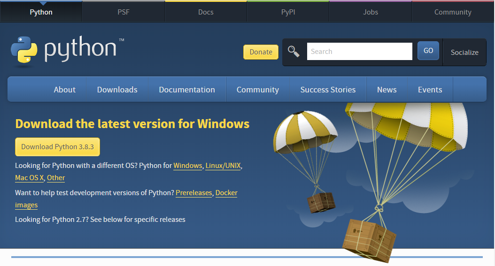

## Consola

La consola es ...

Podemos recuperar las últimas instrucciones usando el cursor


Podemos ejecutar pequeños programas

¿Se puede recuperar las ultimas lineas a fichero?

exit()

help()

help(modulo)

help(funcion)

### Instalación de python sin IDE

Si sólo quieres instalar el intérprete de Python puedes seguir estos pasos

#### Linux/Ubuntu/Raspberry

La mayoría de las distribuciones de Linux (y derivados) ya traen instalado python, puesto que se necesita para algunas aplicaciones. Pero si no es el caso puedes instalarlo desde una consola/terminal con:

```sh
sudo apt update
sudo apt install python3
```

#### MacOS

Accede con un navegado a la página [www.python.org/downloads](http://www.python.org/downloads) y pulsa en descargar


Cuando termine la descarga pulsa en el ejecutable para comenzar con la instalación


#### Windows

Tenemos 2 alternativas: instalar desde la Tienda de Software de Microsoft (la opción recomendada) o desde la página oficial de Python

##### Tienda de Software de Microsoft

Buscamos python en el buscador y pulsamos en obtener


Y cuando termine la instalación lo ejecutamos


##### Instalación desde la página de Python

Accede con un navegado a la página [www.python.org/downloads](http://www.python.org/downloads) y pulsa en descargar



Ejecuta el instalador y asegúrate de marcar la opción de "Añadir python al Path"


#### Comprobación


Una vez instalado ejecutamos 

```sh
python
```

y nos aparecerá la versión. Para salir escribimos **quit()** y pulsamos la tecla **Enter**