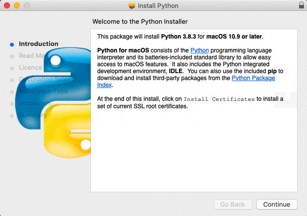

### Instalación de python sin IDE

Si sólo quieres instalar el intérprete de Python, cosa que no te recomiendo, puedes seguir estos pasos.

#### Linux/Ubuntu/Raspberry

La mayoría de las distribuciones de Linux (y derivados) ya traen instalado python, puesto que se necesita para algunas aplicaciones. Pero si no es el caso puedes instalarlo desde una consola/terminal con:

```sh
sudo apt update
sudo apt install python3
```

#### MacOS

Accede con un navegador a la página [www.python.org/downloads](http://www.python.org/downloads) y pulsa en descargar


Cuando termine la descarga pulsa en el ejecutable para comenzar con la instalación




#### Windows

Tenemos 2 alternativas: instalar desde la página oficial de Python o desde la Tienda de Software de Microsoft (la opción recomendada)


##### Instalación desde la página de Python

Accede con un navegado a la página [www.python.org/downloads](http://www.python.org/downloads) y pulsa en descargar


Ejecuta el instalador y asegúrate de marcar la opción de "Añadir python al Path". Con esto hacemos que podamos ejecutar el intérprete de python desde cualquier lugar de nuestro ordenador.

Configuramos las siguientes opciones para que se instale el gestor de paquetes "pip" y "py launcher"


También marcamos la opción de "Asociamos ficheros con Python"


##### Tienda de Software de Microsoft

Buscamos python en el buscador y pulsamos en obtener


Y cuando termine la instalación lo ejecutamos


#### Comprobación


Una vez instalado ejecutamos desde una consola *cmd*

```sh
python3
```

y nos aparecerá la versión. Para salir escribimos **quit()** y pulsamos la tecla **Enter**

Si nos dice que no se encuentra, quizás no hayamos marcado la opción de "Añadir python al Path".

