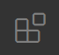

## Instalación

Descargamos desde www.python.org/downloads la versión 3.x

En windows no debemos olvidar marcar la opción de "Añadir python al Path"


En linux suele venir instalado por defecto

Si tenemos también instalada la versión 2 podemos ejecutar la 3 con 
python3


ejecutamos 

```
python
```

y nos aparecerá la versión

para salir escribimos **quit()** y pulsamos la tecla **Enter**

## IDE vs editores

Dado que python es interpretado, para crear un programa solo necesitamos un editor de texto, pero para programar en serio debemos usar un IDE

Un IDE es un Entorno Integrado de Desarrollo y nos aporta ventajas y herramientas que nos facilitan el desarrollo como: correctores, escritura predictiva, depuradores, plantillas, etc.


Ejemplo de escritura predictiva donde el IDE nos muestra las posiblidades para ahorrarnos tener que escribir toda la sentencia

### pyCharm

Es un IDE profesional que dispone de una versión gratuita (con menos opciones)

### pyDev

Es un IDE gratuito

### Visual Studio Code

Es el Entorno de programación OpenSource de Microsoft  que se puede usar con diferentes lenguajes


Permite programar con diferente lenguajes: Python, C, C++, Java, arduino, ... incluso usando diferentes plataformas, p
or ejemplo Arduino con Plataform IO o herramientas de programación para Lego. Además integra herramientas de gestión d
e código como git y de depuración.

Para usar diferentes lenguajes y/o plataformas usaremos extensiones

Está disponible para los sistemas operativos más frecuentes


Descargamos desde [la página de descargar](https://code.visualstudio.com/Download) la versión para nuestro sistema operativo

Lo instalamos y procedemos a buscar las extensiones.

Pulsamos el icono de las extensiones 

Y buscamos la extensión para python


Y pulsamos sobre **Install**

En lugar de utilizar muchas barras de iconos, para acceder a las diferentes funcionalidades Pulsamos **F1** o **ctrl +  shift + P** y buscamos la opción que queremos usar, poniendo en primer lugar la extensión.

[Python con Visual Studio Code](https://code.visualstudio.com/docs/python/python-tutorial)

### mu-editor

Es un algo más que un editor pero menos que un IDE

Está escrito en python

En Ubuntu podemos instalarlo haciendo

```
sudo pip3 install mu-editor
```


### Thonny

Es un algo más que un editor pero menos que un IDE y está  escrito en python

sudo apt instal thonny

TODO: pantallazo
TODO: mostrar cómo se usa la consola

## Editores

### Atom

### Sublime Text

También es de pago pero con una versión gratuita con anuncios


