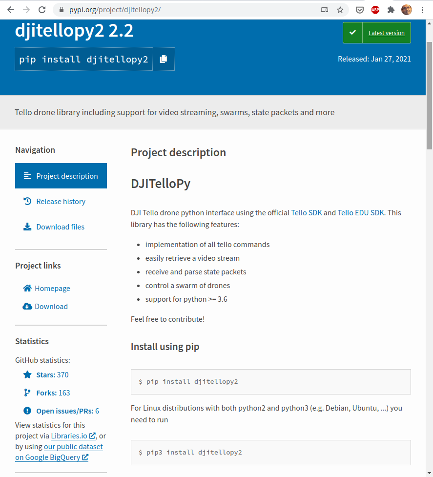

## Instalación de nuevo módulos

Si bien es cierto que son muchos los módulos que incluye la librería estándar, en el mundo Python tenemos la suerte de que miles de programadores están constantemente desarrollando, mejorando y creando nuevos módulos que a veces sólo facilitan algunas tareas mientras que otras abren nuevos campos de aplicación.

Por eso es importante tener un sistema de administración y gestión de módulos para poder instalar y actualizar los paquetes instalados.

Por defecto en todas las instalaciones de Python, a partir de la versión 3.4, se incluye la herramienta *pip* (*Pip installs packages*, ¡sí el nombre es recursivo!) que nos facilita la tarea de instalar paquetes que no forman parte de la librería estándar.

Y ¿dónde podemos encontrar estos módulos? El mejor repositorio de paquetes es [Python Package Index](https://pypi.org/) (PyPI)


El proceso de instalación de un paquete con pip tiene varias etapas:

* Se localiza el paquete en el repositorio de pip.
* Se estudian sus dependencias (los paquetes de los que depende y las versiones necesarias para que funcione).
* Se comprueba si los paquetes de los que depende están instalados, y en las versiones correspondientes.
* Se instalan aquellos que nos faltan.
* Si se cumplen todas las dependencias se instala el paquete
* La instalación de los paquetes hace que estos estén disponibles desde nuestro código

A veces para la instalación de un paquete python es necesario que tengamos instalada una librería o un software previamente. Algunos paquetes están configurados para descargar el código fuente de estas librerías y compilarlo si no las tenemos instaladas previamente.

### Uso de pip

Si queremos instalar un módulo con pip haremos desde la consola de nuestro sistema operativo (no desde dentro del intérprete Python)

```sh
$ pip install paquete
```

La herramienta *pip* buscará en el repositorio *PyPi* ese paquete, detectará sus dependencias e instalará todos los módulos necesarios para que "paquete" funcione.

Si usamos Google Colab usaremos el comando "!pip" para las instalaciones, y dado que los ficheros se borrarán al desconectar, tendremos que incluir unas instrucciones al principio de nuestro documento para que se instale todo lo necesario antes de que podamos utilizarlo.


Cuando instalamos en Linux con  pip podemos hacerlo como usuario o como administrador, el resultado es que se instalará en nuestro directorio personal o en el sistema. Si instalas como administrador corremos el riesgo de alterar el funcionamiento del sistema.


Al usar pip, se comprueba si existe una nueva versión disponible y en ese caso aparece un mensaje que nos recomienda actualizarlo con el comando

```sh
$ python3 -m pip install --upgrade pip
```

Si por alguna razón tenemos instalado Python 2 en nuestro sistema podemos asegurarnos de que se instala el paquete para la versión 3 usando *pip3* en lugar de pip.


Vamos a ver más opciones de pip:

* Podemos saber la versión de *pip* que tenemos instalada con:

```sh
$ pip --version
```

* Como hemos dicho antes, para instalar un paquete haremos:

```sh
$ pip install PackageName
```

* Podemos elegir que se instale un versión concreta de un paquete con:

```sh
$ pip install 'PackageName==1.4'
```

* Para actualizar un paquete haremos:

```sh
$ pip install --upgrade PackageName
```
* Podemos desinstalar un paquete con:

```sh
$ pip uninstall PackageName
```

* Para mostrar los módulos que tenemos instalados usaremos:

```sh
$ pip list
```

* Podemos ver los detalles de un módulo que tenemos instalado con:

```sh
$ pip show requests
```

Entre los detalles aparecen los módulos que se requieren para usar el módulo y los módulos que requieren de éste.

Hagamos un ejemplo. Voy a instalar el módulo *requests* que usaremos más adelante y que nos permite acceder desde nuestro código a páginas webs:

```sh
$ pip3 install requests
Defaulting to user installation because normal site-packages is not writeable
Requirement already satisfied: requests in /home/javacasm/.local/lib/python3.6/site-packages (2.22.0)
Collecting idna<2.9,>=2.5
  Using cached idna-2.8-py2.py3-none-any.whl (58 kB)
Requirement already satisfied: chardet<3.1.0,>=3.0.2 in /home/javacasm/.local/lib/python3.6/site-packages (from requests) (3.0.4)
Requirement already satisfied: certifi>=2017.4.17 in /home/javacasm/.local/lib/python3.6/site-packages (from requests) (2019.11.28)
Requirement already satisfied: urllib3!=1.25.0,!=1.25.1,<1.26,>=1.21.1 in /home/javacasm/.local/lib/python3.6/site-packages (from requests) (1.25.8)
Installing collected packages: idna
  Attempting uninstall: idna
    Found existing installation: idna 2.9
    Uninstalling idna-2.9:
      Successfully uninstalled idna-2.9
Successfully installed idna-2.8
```
* En la primera línea nos dice que al ser un usuario normal no puede instalar en el sistema y se hará la instalación en el directorio del usuario.
* Vemos las dependencias y cómo algunas de ellas ya están instaladas.
* En alguna de las dependencias se muestra que la versión debe cumplir algunas condiciones: urllib3!=1.25.0 ó chardet<3.1.0,>=3.0.2

* Podemos generar un listado de todos los módulos que necesitamos para ejecutar algo y guardarlo en un fichero:

```sh
$ pip freeze > requisitos.txt
```
En el fichero quedarán los paquetes instalados y las versiones instaladas.

Si queremos reproducir esa configuración de instalación lo haremos con:

```sh
$ pip install -r requisitos.txt
```

Esto es algo que se hace en entornos profesionales para reproducir la configuración de una máquina en otra.


[](https://drive.google.com/file/d/1s5I8qyNVl7J1Oxw_SYfSaZN6jR89_gqm/view?usp=sharing)

[Vídeo: Instalando módulos Python con pip](https://drive.google.com/file/d/1s5I8qyNVl7J1Oxw_SYfSaZN6jR89_gqm/view?usp=sharing)


### Ejemplos


#### Controlando drones con python

Ejemplo: si queremos instalar un módulo python para controlar los drones de DJI Tello Edu, basta con que [busquemos en la página pypi.org "dji tello edu"](https://pypi.org/search/?q=dji+tello+edu&o=)

Mirando el detalle del primer resultado DJITelloPy



Vemos:

* Actualizado a python >=3.6
* Última versión del 27 de enero de 2021
* El repositorio de github tiene 370 estrellas
* Y se han realizado 163 fork ([proyectos derivados])

Además vemos que tiene un excelente [página de documentación](https://djitellopy.readthedocs.io/en/latest/) y [ejemplos](https://github.com/damiafuentes/DJITelloPy/tree/master/examples/) en la misma página de pip

```python
from djitellopy import Tello

tello = Tello()

tello.connect()
tello.takeoff()

tello.move_left(100)
tello.rotate_counter_clockwise(90)
tello.move_forward(100)

tello.land()
```

Si lo instalamos en nuestro pc con linux 
```sh
pip3 install djitellopy2
```


Si ahora lo instalamos en una Raspberry


Vemos que instala los mismos paquetes pero usa versiones diferentes

#### Haciendo capturas de pantalla con python (linux)

Podemos automatizar desde python la captura de pantallas en ordenadores con linux, por ejemplo para generar videotutoriales haciendo time-lapse de nuestro trabajo.

Para ello instalamos primero el paquete *scrot* que es el que se encarga de hacer la captura. Lo haremos con:

```sh
sudo apt install scrot
```

Ahora instalamos el módulo *pyautogui* que, entre otras cosas, nos permite hacer las capturas. Lo instalamos con pip así:

```sh
pip3 install pyautogui
```

Y ya podemos hacer capturas desde python con:

```python
>>> import pyautogui
>>> myScreenshot = pyautogui.screenshot()
>>> myScreenshot.save('~/Imágenes/Capturas de pantalla/file1.png')
```
