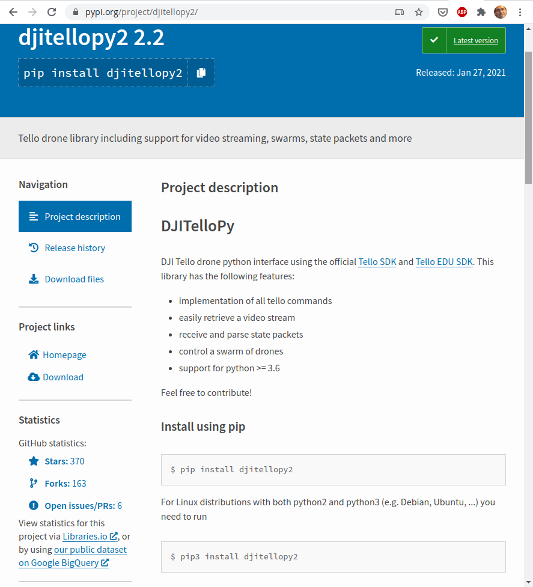
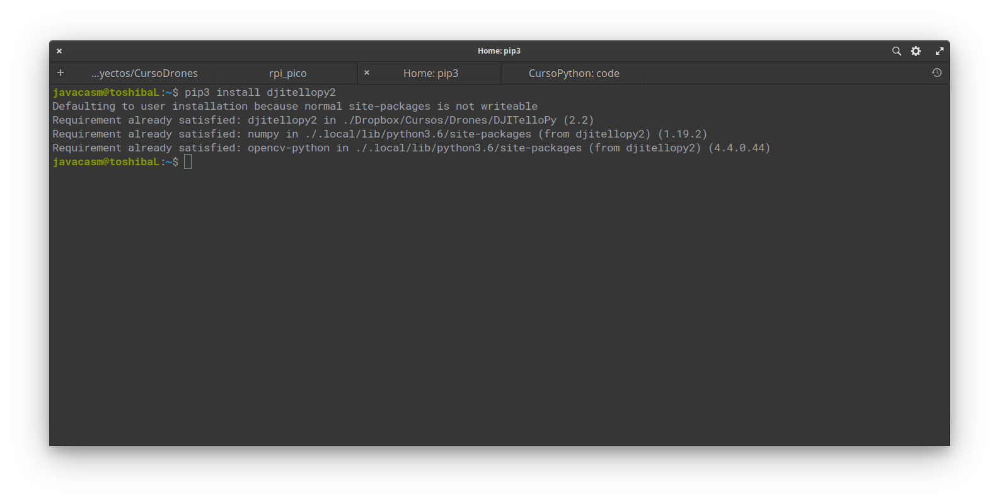
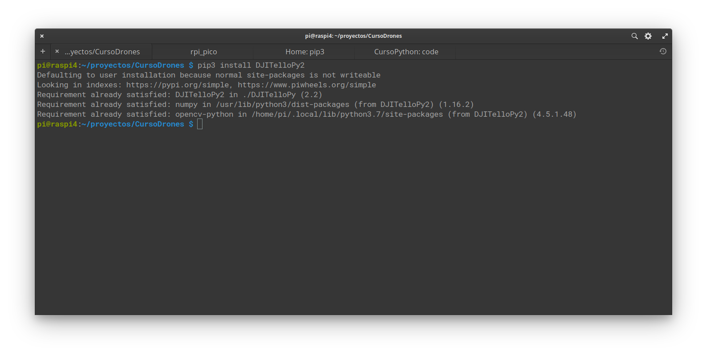

## Instalación con pip
Uso de pip 

modulos https://www.w3schools.com/python/python_modules.asp


¿Qué es pip?

Cuando instalamos con  pip podemos hacerlo como usuario o como administrador, el resultado es que se instalará en nuestro directorio personal o en el sistema

Si es en el directorio personal tendremos que asegurarnos que ese directorio está en el path

Por ejemplo en mi sistema usa linux estará en **/home/javacasm/.local/bin/thonny**


TODO: https://www.w3schools.com/python/python_pip.asp

Repositorio de módulos pypi.org

herramienta pip (pip3 para asegurar usar python3)

gestión de dependencias

Permite la instalación de paquetes en el directorio del usuario


Ejemplo: si queremos instalar un módulo python para controlar los drones de DJI Tello Edu, basta con que [busquemos en la página pypi.org "dji tello edu"](https://pypi.org/search/?q=dji+tello+edu&o=)

Mirando el detalle del primer resultado DJITelloPy



Vemos:

* Actualizado a python >=3.6
* Última versión del 27 de enero de 2021
* El repositorio de github tiene 370 estrellas
* Y se han realizado 163 fork ([proyectos derivados])

Además vemos que tiene un excelente [página de documentación](https://djitellopy.readthedocs.io/en/latest/) y [ejemplos](https://github.com/damiafuentes/DJITelloPy/tree/master/examples/) en la misma página de pip

```python
from djitellopy import Tello

tello = Tello()

tello.connect()
tello.takeoff()

tello.move_left(100)
tello.rotate_counter_clockwise(90)
tello.move_forward(100)

tello.land()
```

Si lo instalamos en nuestro pc con linux 
```sh
pip3 install djitellopy2
```




Si ahora lo instalamos en una Raspberry



Vemos que instala los mismos paquetes pero usa versiones diferentes
