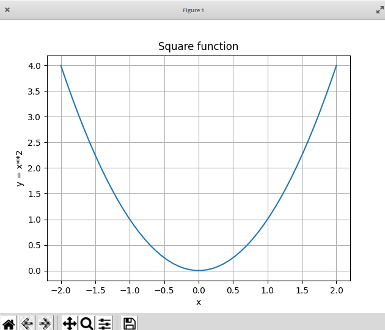
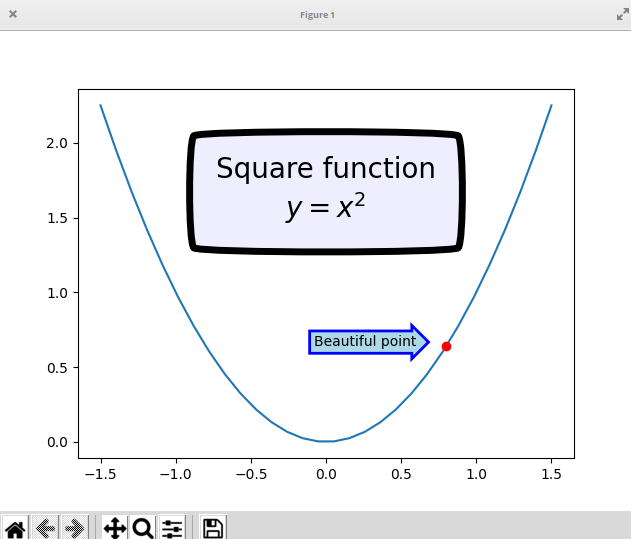
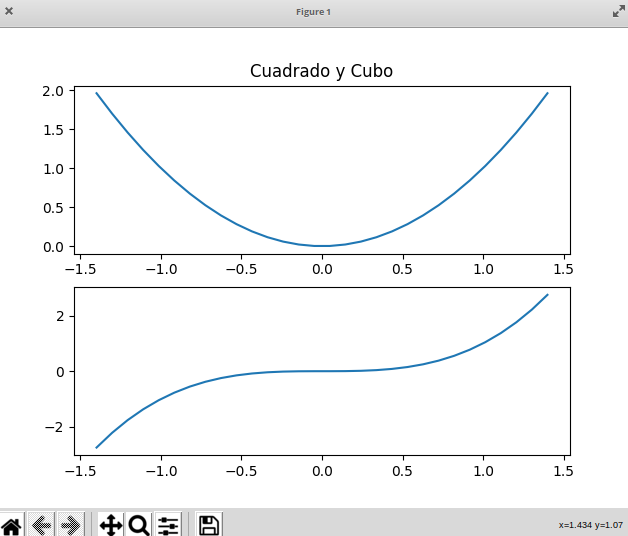
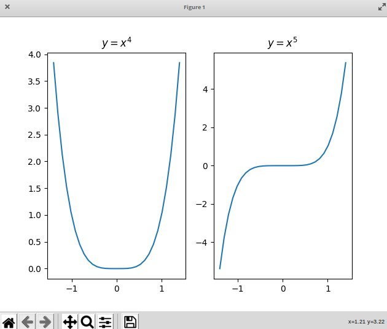
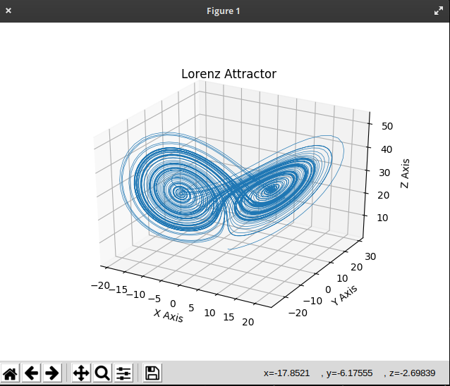

# Representación gráfica de datos: 

Vamos a utilizar el módulo matplotlib para realizar representaciones gráficas de datos como las que vemos a continuación:


Lo instalamos con pip:

```sh
pip install matplotlib
```
O desde el gestor de módulos de Thonny.

Un sencillo ejemplo para visualizar una lista de valores:

```python
import matplotlib.pyplot as plt
# series
lista = [10,2,15,56]
plt.plot(lista)
plt.show() 
```

Es necesario llamar al método *show()* tras configurar nuestro gráfico para que se visualice el gráfico. Tras esta llamada se renderiza todo"


Si queremos mostrar un gráfico x-y, daremos las dos series al método *plot*:

```python
# x vs y
import matplotlib.pyplot as plt
serieX = [1,4,6,7]
serieY = [2,4,5,7]
plt.plot(serieX,serieY)

# axis([minX,maxX,minY,maxY])
plt.axis([0,10,0,8])
plt.show()
```

También podemos usarlo para dibujar funciones matemáticas. En el siguiente ejemplo vamos a usar un módulo llamado numpy (que tendrás que instalar) para generar los datos. Es un módulo muy utilizado para hacer cálculos matemáticos. Usaremos el método *linspace* que nos genera una "lista" de puntos de un modo similar a como lo haríamos con range, pero utilizando números con decimales.

```python

# dibujando funciones
import matplotlib.pyplot as plt
import numpy as np
# 50 puntos equiespaciados entre el mínimo y el máximo y lo guarda en un array de numpy
x = np.linspace(-2,2,50) 

y = x**2 # y será una "lista" con los valores de x al cuadrado

plt.plot(x, y)
plt.show()
```

Podemos dar mejor aspecto al gráfico anterior añadiendo un título, etiquetas a los ejes y una rejilla. Lo pondremos todo antes de llamar al método *plt.show()*:

```python
# poniéndolo bonito

plt.title('Función cuadrado')
plt.xlabel('x')
plt.ylabel('y = x**2')
plt.grid(True)
```


Desde el interfaz de cada gráfico podemos hacer zoom, movernos por las coordenadas o guardar una copia a disco.

También podemos añadir varios gráficos en una misma representación. Por defecto todos salen bajo los mismos ejes de coordenadas. Lo podemos hacer con varias llamadas al método *plot* 

```python
# Podemos añadir varios gráficos

z = y + 2
plt.plot(x,y)
plt.plot(x,z)
# o añadiendo todas los pares de valores en una llamada
```

o incluyendo varias series en la llamada
```python

plt.plot(x,y,x,z)

```
Para distinguir entre los diferentes gráficos podemos añadir un tercer argumento a la llamada *plot* que será una cadena que indique el color con un primer carácter y el tipo de línea con los siguientes. Puedes consultar los distintos tipos de líinea en la [documentación](http://matplotlib.org/api/pyplot_api.html#matplotlib.pyplot.plot)

```python

w = z - 5

plt.plot(x,y,'r')   # línea rojo 
plt.plot(x,z,'g--') # línea gris discontinua
plt.plot(x,w,'b.')  # azul punteada

plt.plot(x,y,'r^')
plt.plot(x,z,'g:')
plt.plot(x,w,'bx')
plt.show()
```

Cuando la tengamos a nuestro gusto la podemos guardar como fichero con el método *savefig*:

```python
plt.savefig('my_square_function.png', transparent=True)
```

Existen más tipos de gráficos, como por ejemplo *scatter* pensado para cuando vamos a representar puntos sueltos:

```python

# Scater (punto x,y sueltos)
x = [2, 4, 5, 7, 6]
y = [6, 3, 4, 6, 9]

plt.scatter(x,y,0.5,c='Black')
#help(plt.scatter)
plt.show()
```

También podemos añadir puntos sueltos y cajas con texto *plt.text()*, como hacemos en este ejemplo:

```python
x = np.linspace(-1.5, 1.5, 30)
px = 0.8
py = px**2

plt.plot(x, x**2, px, py, 'ro') # añadimos el punto rojo px,py 

bbox_props = dict(boxstyle='rarrow,pad=0.3', ec='b', lw=2, fc='lightblue')

plt.text(px-0.2, py, 'Bonito punto', bbox=bbox_props, ha='right')

bbox_props = dict(boxstyle='round4,pad=1,rounding_size=0.2', ec='black', fc='#EEEEFF', lw=5)

plt.text(0, 1.5, 'Función Cuadrado\n$y = x^2$', fontsize=20, color='black', ha='center', bbox=bbox_props)

plt.show()

```


Donde hemos usado las propiedades de la caja:

* boxstyle: una flecha para el primero y una caja redondeada para el segundo.
* lw: ancho de línea
* ec: color del contorno
* fc: color de fondo


Hasta ahora todos los gráficos los hemos representado bajo unos mismos ejes. También podemos hacer que aparezcan separados usando el método *subplot* al que le pasaremos un número entero cuyo primer dígito representa el número de filas, el segundo la columna y el tercero la fila. Sí es un poco lioso, mejor lo vemos con un par de ejemplos:

Para usar 2 filas en 1 columna:

```python

x = np.linspace(-1.4, 1.4, 30)

plt.subplot(211) # usaremos 2 filas y 1 columna, gráfico fila 1
plt.plot(x, x**2)
plt.title("Cuadrado y Cubo")
plt.subplot(212) # usaremos 2 filas y 1 columna, gráfico fila 2
plt.plot(x, x**3)
plt.show()
```


Para usar 1 fila en 2 columnas:

```python
plt.subplot(121) # usaremos 1 fila y 2 columna, gráfico columna 1
plt.plot(x, x**4)
plt.title("$y=x^4$") # Usamos la representación de texto en latex
plt.subplot(122) # usaremos 1 fila y 2 columna, gráfico columna 2
plt.plot(x, x**5)
plt.title("$y=x^5$")
plt.show()
```



También podemos hacer gráficos en 3D usando los 3 ejes. Este [ejemplo de la librería matplotlib](https://matplotlib.org/stable/gallery/mplot3d/lorenz_attractor.html) nos lo muestra:


```python
# Ejemplo de https://matplotlib.org/stable/gallery/mplot3d/lorenz_attractor.html
import numpy as np
import matplotlib.pyplot as plt
from mpl_toolkits.mplot3d import Axes3D


def lorenz(x, y, z, s=10, r=28, b=2.667):
    """
    Given:
       x, y, z: a point of interest in three dimensional space
       s, r, b: parameters defining the lorenz attractor
    Returns:
       x_dot, y_dot, z_dot: values of the lorenz attractor's partial
           derivatives at the point x, y, z
    """
    x_dot = s*(y - x)
    y_dot = r*x - y - x*z
    z_dot = x*y - b*z
    return x_dot, y_dot, z_dot


dt = 0.01
num_steps = 10000

# Need one more for the initial values
xs = np.empty(num_steps + 1)
ys = np.empty(num_steps + 1)
zs = np.empty(num_steps + 1)

# Set initial values
xs[0], ys[0], zs[0] = (0., 1., 1.05)

# Step through "time", calculating the partial derivatives at the current point
# and using them to estimate the next point
for i in range(num_steps):
    x_dot, y_dot, z_dot = lorenz(xs[i], ys[i], zs[i])
    xs[i + 1] = xs[i] + (x_dot * dt)
    ys[i + 1] = ys[i] + (y_dot * dt)
    zs[i + 1] = zs[i] + (z_dot * dt)


# Plot
fig = plt.figure()
ax = fig.gca(projection='3d')

ax.plot(xs, ys, zs, lw=0.5)
ax.set_xlabel("X Axis")
ax.set_ylabel("Y Axis")
ax.set_zlabel("Z Axis")
ax.set_title("Lorenz Attractor")

plt.show()
```



Muchísimos más detalles en la [Documentación oficial de matplotlib](https://colab.research.google.com/github/ageron/handson-ml2/blob/master/tools_matplotlib.ipynb#scrollTo=st_zTGp_aeJQ)

### Trabajando con ficheros de datos: Pandas

Vamos a trabajar con ficheros de datos, tipo CSV utilizando el módulo **pandas**, pensado para trabajar con grandes tablas de datos. Es una de las herramientas más usadas hoy en día para *Minería de Datos*.

Como es normal instalamos el módulo con *pip*:

```python
pip3 install pandas
```

También podemos instalar desde el gestor de paquetes de Thonny.

Podemos leer un fichero csv (valores separados por comas) desde pandas haciendo:

```python
import pandas 

datos = pandas.read_csv('./data/company_sales_data.csv',sep = ',') 
```
Donde vemos que además del nombre del fichero (puedes descargar de [aquí](https://github.com/javacasm/CursoPython/raw/master/codigo/data/company_sales_data.csv) los datos de nuestro ejemplo) indicamos el separador "sep" que se usa en el fichero, en este caso la ",".

En *datos* tendremos lo que se conoce como un *dataFrame* que es  una tabla, donde vamos a poder trabajar con sus columnas. Por ejemplo podemos acceder a las columnas por nombre *datos['shampoo']* y podemos iterar por las columnas usando su nombre:

```python
for data in datos:
    print(data)
```

o por los valores dentro de una columna:

```python
for data in datos['toothpaste']:
    print(data)
```
Podemos representar gráficamente los valores de dos columnas:

```python
yValues = datos['total_profit']
xValues = datos['month_number']

plt.plot(xValues,yValues)
plt.title('Beneficio total mensual')
plt.xticks(xValues)
plt.yticks([100000,200000,300000,400000,500000])
plt.xlabel('Mes')
plt.ylabel('Beneficio total')

```

Vamos a aprovechar para utilizar *pandas* desde dentro de un [documento *jupyter*](https://raw.githubusercontent.com/javacasm/CursoPython/master/codigo/10.5.pandas.ipynb) en el siguiente vídeo:


[](https://drive.google.com/file/d/13CC3ZU8GA0-ZdfOqGyH96BbxlWXZysph/view?usp=sharing)

[Vídeo: Trabajando con ficheros de datos: Pandas](https://drive.google.com/file/d/13CC3ZU8GA0-ZdfOqGyH96BbxlWXZysph/view?usp=sharing)


