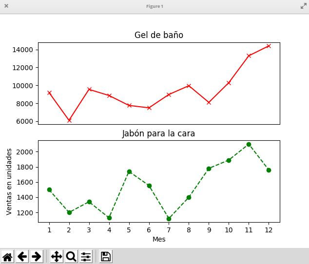
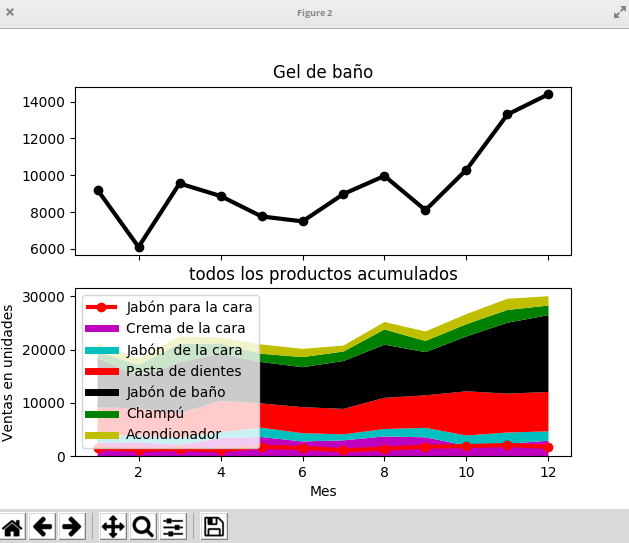
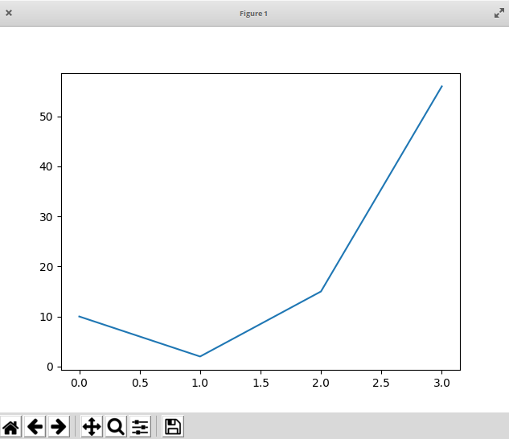

# Representación gráfica de datos: 






numpy y matgplot
codigo/10.5.graficando.py

https://www.edureka.co/blog/python-matplotlib-tutorial/

https://matplotlib.org/3.1.1/tutorials/introductory/pyplot.html#sphx-glr-tutorials-introductory-pyplot-py

Leyenda https://matplotlib.org/stable/api/_as_gen/matplotlib.pyplot.legend.html


[Ejercicios sobre Gráficos con matPlotLib](https://pynative.com/python-matplotlib-exercise/)


### Trabajando con ficheros de datos: Pandas

pandas
codigo/10.5.pandas.ipynb

Instalamos el módulo con 

```python
pip3 install pandas
```

https://pandas.pydata.org/pandas-docs/version/0.17.0/10min.html

https://www.edureka.co/blog/python-pandas-tutorial/

https://realpython.com/pandas-sort-python/

https://realpython.com/pandas-plot-python/

https://github.com/ajcr/100-pandas-puzzles


[](https://drive.google.com/file/d/13CC3ZU8GA0-ZdfOqGyH96BbxlWXZysph/view?usp=sharing)

[Vídeo: Trabajando con ficheros de datos: Pandas](https://drive.google.com/file/d/13CC3ZU8GA0-ZdfOqGyH96BbxlWXZysph/view?usp=sharing)


[Ejercicios sobre Pandas](https://pynative.com/python-pandas-exercise/)


