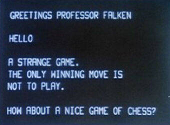

## Espeak

[Documentación](https://pyttsx3.readthedocs.io/en/latest/engine.html)

[Código](https://github.com/nateshmbhat/pyttsx3)

[Vídeo: Texto a Voz (Text to Speech) con pyttsx3](https://youtu.be/sI8EeZGPNgw)

## Aplicación: Joshua juega a las 20 Preguntas

[Vídeo: Joshua juega a 20 Preguntas](https://youtu.be/kNAXuEUdisI)