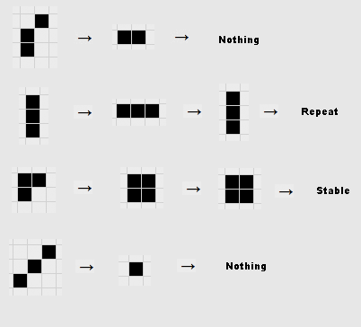
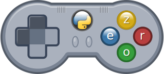

# Videojuegos con pyGame 


Según la [wikipedia](https://en.wikipedia.org/wiki/Pygame) [pygame.org](https://www.pygame.org/) "es un conjunto multiplataforma de módulos de Python diseñados para escribir videojuegos. Incluye gráficos de computadora y bibliotecas de sonido diseñadas para ser utilizadas con el lenguaje de programación Python." 

"Permiten la creación de videojuegos en dos dimensiones de una manera sencilla. Está orientado al manejo de sprites."

Se trata de un desarrollo Open Source, mantenido activamente por la comunidad. Su primer versión data de octubre del 2000 a partir de otro proyecto, PySDL cuyo desarrollo quedó estancado.

### Instalación

Para instalarlo sólo tenemos que hacer 

```sh 
pip3 install pygame
```

O también podemos instalarlo desde nuestro entorno, por ejemplo desde Thonny

[](https://youtu.be/lbd1qWOajyU)


[Vídeo: Instalación de pyGame desde Thonny](https://youtu.be/lbd1qWOajyU)


### Bucle de eventos

Como en la mayoría de los videojuegos, en Pygame, existe un bucle central donde se repiten continuamente los mismos pasos. Por eso todo programa pyGame (y casi todos los videojuegos) siguen la siguiente estructura:

* Bloque de inicialización, donde preparamos todo, cacheamos todo lo que podamos
* Bucle principal, que se repite mientras no salgamos del videojuego. Dentro de éste tenemos la siguientes partes:
    * Detectamos los eventos de usuario: teclado, ratón, mandos, joysticks, etc.
    * En función del estado de los controles calculamos las nuevas posiciones de los elementos del juego
    * Calculamos la nueva posición, así como la reacción de los "enemigos"
    * Dibujamos en el orden adecuado, todos los elementos: primero el fondo y finalmente los más cercanos al usuario y por tanto más visibles. Todo esto lo hacemos en una copia interna de la pantalla.
    * Copiamos esta "pantalla interna" a la memoria de vídeo para que se muestre al usuario
    
Vamos a ver en un sencillo ejemplo de pyGame esta estructura


```python
"""
Tutorial básico de pyGame
02 - Definimos colores de diferente formas:
* Usando la clase pygame.Color:
    * Usando nombres de colores : 'Red', 'Blue', 'Black', 'Aqua' ¿Listado?
* Usando una tupla de 3 valores para la intensidad ¿Alpha?
Usamos el método fill sobre surface para rellenar la ventana de un color dado
Docs: 
* Sobre la clase Color https://www.pygame.org/docs/ref/color.html
* Colores definidos https://github.com/pygame/pygame/blob/master/src_py/colordict.py

CC by SA @javacasm
Junio 2020
"""

import pygame

width = 640
height = 400


# 3 formas de definir los colores
red = pygame.Color('Red')
cyan = pygame.Color('cyan')
blue = pygame.Color(0,0,255) # ¿alpha?
green = (0,  255, 0)
white = (255,255,255)
black = (0,0,0)

pygame.init() # Inicializa el entorno de pygame

screen = pygame.display.set_mode((width, height))
pygame.display.set_caption('Ejemplo colores')

running = True

while running:
    for event in pygame.event.get():
        if event.type == pygame.QUIT:
            running = False 
    
    screen.fill(green) # rellenamos la pantalla de verde

    pygame.display.flip()  # actualizamos la pantalla

pygame.quit()     

```

El envento QUIT se producirá al pulsar el botón de cerrar la ventana.

[](https://youtu.be/GM7MhN8Ef2U)

[Vídeo:  Primer ejemplo con pyGame](https://youtu.be/GM7MhN8Ef2U)


## Eventos de teclado

Vamos a ver ahora cómo podemos dibujar una forma (un rectángulo) que se moverá al pulsar las teclas del curso. [código](https://github.com/javacasm/RaspberryOnline2ed/raw/master/codigo/Tut08_movimientoRectangulo.py)

Para ello vamos a detectar un nuevo tipo de evento: el de las pulsaciones de las teclas **pygame.KEYDOWN**. Una vez detectado un evento de ese tipo veremos la tecla pulsada viendo la propiedad **event.key** que guardará un valor del tipo  **pygame.K_XXXXXXX**

Haremos que el programa reaccione a las pulsaciones de las teclas del cursor y a la letra **Q** que hará que el programa salga.


```python
import pygame

"""
Tutorial básico de pyGame
08.2 - Movimiento de formas con teclas:

Eventos de teclado:
Propiedades:
* key 
    pygame.K_q ...
    pygame.K_LEFT ...

Docs: 
* Eventos https://www.pygame.org/docs/ref/event.html
* Keys https://www.pygame.org/docs/ref/key.html

CC by SA @javacasm
Junio 2020
"""

width = 640
height = 400


# 3 formas de definir los colores
red = pygame.Color('Red')
cyan = pygame.Color('cyan')
blue = pygame.Color(0,0,255) # ¿alpha?
green = (0,  255, 0)
white = (255,255,255)
black = (0,0,0)

pygame.init() # Inicializa el entorno de pygame

screen = pygame.display.set_mode((width, height))
pygame.display.set_caption('Movimiento rectángulo')

# coordenadas del cuadrado
x = 200
y = 200

# tamaño del rectángulo
rect_width = 20
rect_height = 20

# velocidad de movimiento
vel = 10

running = True

while running:
    for event in pygame.event.get():
        if event.type == pygame.QUIT:
            running = False 
    
    if event.type == pygame.KEYDOWN:
            print('Teca pulsada: '+event.unicode)

            if event.key == pygame.K_q: # salimos con la tecla q
                running == False

            if event.key == pygame.K_LEFT:
                print('Movmiento izda')
                x -= vel

            if event.key == pygame.K_RIGHT:
                print('Movmiento drcha')                
                x += vel

            if event.key == pygame.K_UP:
                print('Movmiento arriba')
                y -= vel

            if  event.key == pygame.K_DOWN:
                print('Movmiento abajo')        
                y += vel

    screen.fill(black) # ponemos el fondo negro

    pygame.draw.rect(screen, (255, 0, 0), (x, y, rect_width, rect_height)) # después dibujamos el rectángulo

    pygame.display.flip()  # actualizamos la pantalla

pygame.quit()     
```
[](https://youtu.be/NMqUgtNLXbM)

[Vídeo: Eventos de teclado y movimiento de gráficos](https://youtu.be/NMqUgtNLXbM)


### Moviendo imágenes y con música

Si ahora queremos mover una imágen sólo tenemos que cambiar un par de cosas:
1. Cargar la imagen antes de empezar el bucle
```python
miImagen = pygame.image.load('./images/python-logo.png')
```
2. En lugar de dibujar el rectángulo copiaríamos la imagen en x,y, tras rellenar el fondo
```python
    screen.blit(miImagen,(x, y))
```
[código](https://github.com/javacasm/RaspberryOnline2ed/raw/master/codigo/Tut08.1_movimientoImagen.py)

Ya que sabemos cómo añadir una imagen podemos añadir una imagen de fondo.
```python
miFondo = pygame.image.load('./images/fondo.png') # lo cargamos
```
y ahora sustituimos el rellenar el fondo con un color por 
```python
     screen.blit(miFondo,(0,0))
```

Nada más fácil que añadir música:
```python
pygame.mixer.music.load('./music/Fortunate_Note.ogg') # cargamos el fichero
pygame.mixer.music.set_volume(0.5 ) # volumen entre 0 y 1.0
pygame.mixer.music.play() # lo reproducimos
```
En algunas versiones y sistemas operativos, por tema de licencias no se reproducen directamente ficheros mp3 (por un tema de patentes). En ese caso podemos convertirlo a otro formato (como el formato libre ogg) y listo. Para ello podemos usar una herramienta opensource como [Audacity](https://www.audacityteam.org/)

[](https://youtu.be/ljGUfcSWEgo)

[Vídeo: Moviendo imágenes con música de fondo](https://youtu.be/ljGUfcSWEgo)


Se deja como ejercicio, ver cómo parar la reproducción de la música con una tecla.

Para animar personajes es mejor trabajar con sprites, como explican en [este tutorial](https://www.pygame.org/docs/tut/SpriteIntro.html)


## Juego de la Vida

Otro ejemplo sencillo es esta implementación del [Juego de la Vida de J. Conway](https://es.wikipedia.org/wiki/Juego_de_la_vida), donde un conjunto de reglas marcan la evolución de las células en un mundo virtual.



El [código](https://github.com/javacasm/RaspberryOnline2ed/raw/master/codigo/pygameOfLife.py) es sencillo y lo hice siguiendo el [tutorial de .dotCSV](https://www.youtube.com/watch?v=qPtKv9fSHZ) "Programando el juego de la vida en 10 minutos"

Puedes "sembrar" organismos con el ratón y verás como evolucionan

Para ejecutarlo también tienes que instalar numpy

```sh
pip3 install numpy
```

Guardaremos el estado de nuestro mundo virtual usando una matriz de valores de numpy. Podíamos haber usado una matriz basada en listas como hemos hecho en otros casos, pero así tenemos una excusa para usar otros módulos.

[](https://youtu.be/B3qDkviOsVk)

[Vídeo:  Juego de la Vida con pyGame](https://youtu.be/B3qDkviOsVk)

## PiGame Zero



Desde hace poco ha aparecido otró módulo python, basado en Pigame, pero con el objetivo de hacer más sencillo el proceso de crealos

[Pygame Zero](https://pygame-zero.readthedocs.io/en/stable/) pretende crear juegos sin la parte repetitiva.

Está diseñado para su uso en educación, de modo que los maestros puedan enseñar programación básica sin necesidad de explicar la API de Pygame o escribir un bucle de eventos.

Existen [tutoriales](https://pygame-zero.readthedocs.io/en/stable/from-scratch.html) que explican a partir de un ejemplo en Scratch cómo hacer el juego equivalente en Pygame Zero

### Instalación 


```sh
pip3 install pgzero
```

### Ejemplos

* Invaders: [tutorial I](https://www.raspberrypi.org/magpi/pygame-zero-invaders/) y [tutorial II](https://www.raspberrypi.org/magpi/pygame-zero-space-invaders-ii/) para crear un auténtico Space Invaders

* PacMan (mi favorito): [tutorial I](https://www.raspberrypi.org/magpi/code-pac-man-in-python/) y [tutorial II](https://www.raspberrypi.org/magpi/)code-pac-man-python-part-2/

* Space shooter [tutorial](https://github.com/joshuawillman/The-Lonely-Shooter)


 
 ## Recursos 

https://realpython.com/pygame-a-primer/
 
[Tutorial de videojuegos con pygame](https://www.pythonmania.net/es/2010/03/23/tutorial-pygame-introduccion/)
        