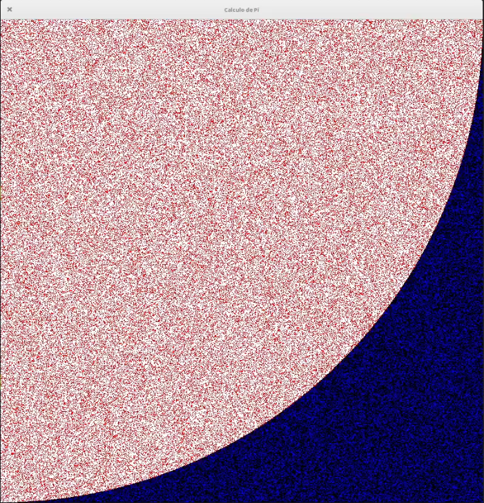
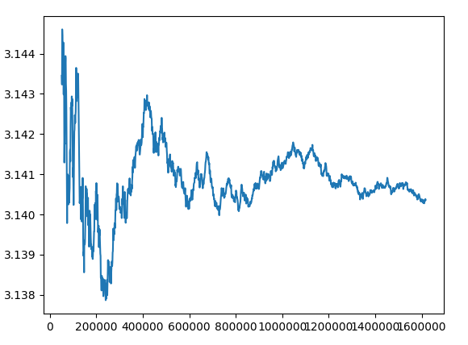

## Cálculo de Pi usando el método MonteCarlo

Aprovechado que es el día de Pi (cuando hice este código) vamos a hacer una sencilla representación de gráfica de cómo calcular el varlo de Pi usando el método MonteCarlo, un método aleatorio que nos permite simular multitud de procesos físicos y matemáticos.

Vamos a lanzar aleatoriamente puntos dentro de un cuadrado que tien un cuarto de círculo inscrito dentro y contaremos cuales de ellos caen dentro del círculo. Como el area del círculo es proporcional al valor de Pi, el cociente entre los que caen dentro del círculo y el número total lo será tambien.



A medida que lancemos más puntos iremos viendo que nos acercamos más al valor de Pi




[](https://drive.google.com/file/d/1ROif4zqG9ZD3gGrCKWplG7y9ucBzdPwy/view?usp=sharing)

[Vídeo: Cálculo de Pi usando el Método MonteCarlo en Python](https://drive.google.com/file/d/1ROif4zqG9ZD3gGrCKWplG7y9ucBzdPwy/view?usp=sharing)


[Código](https://raw.githubusercontent.com/javacasm/CursoPython/master/codigo/11.1.Calculo_pi_v2.py)

```python
"""
Calculo de Pi usando un cuarto de circulo y el cuadrado que lo contiene
CC by SA @javacasm
3.14 14 de Marzo 2021

"""
import pygame
import random

width = 800
height = width
radio = width 

# 3 formas de definir los colores
red = pygame.Color('Red')
cyan = pygame.Color('cyan')
blue = pygame.Color(0,0,255) # ¿alpha?
green = (0,  255, 0)
white = (255,255,255)
black = (0,0,0)

pygame.init() # Inicializa el entorno de pygame

screen = pygame.display.set_mode((width, height))
pygame.display.set_caption('Calculo de Pi')

running = True
screen.fill(black) # rellenamos la pantalla de verde
pygame.draw.circle(screen, white,(0,0),radio)

nPuntos = 0
nDentroCirculo = 0
radio2 = radio*radio

f = open('evo_pi.csv','wt')
f.write('N\tpi_value\n')

while running:
    for event in pygame.event.get():
        if event.type == pygame.QUIT:
            running = False 
    x = random.randint(0,width)
    y = random.randint(0,height)
    nPuntos += 1
    if x*x + y*y <= radio2: # Esta dentro del circulo
        screen.set_at((x,y),red)
        nDentroCirculo += 1
    else:
        screen.set_at((x,y),blue)

    if nPuntos % 1000 == 0:
        pi = nDentroCirculo * 4 / nPuntos
        sMsg =f'{nPuntos}\t{pi}\n'
        print(sMsg,end='')
        f.write(sMsg)
        f.flush()
    
    pygame.display.flip()  # actualizamos la pantalla

f.close()
pygame.quit()     

```

