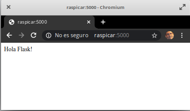

## Servidor Web con Flask

Vamos a crear una sencilla aplicación web que el mismo robot publicará en su web y que nos permitirá controlarlo fácilmente. Para ello usaremos flask, un módulo python, que y usamos anteriormente y que nos permite crear aplicaciones web de manera muy sencilla. La instalación y primeros pasos es muy sencilla y podermos verla en detalle en [este proyecto de Raspberry Pi org](https://projects.raspberrypi.org/en/projects/python-web-server-with-flask)

Instalamos flask

```sh
pip3 install flask
```
creamos la carpeta de aplicación webApp

```sh
mkdir webApp
```

y dentro creamos una versión de prueba de la aplicación en el fichero app.py

```python
from flask import Flask

app = Flask('Primera prueba de flask')

@app.route('/') # la asociamos al directorio raiz del servidor web
def index():
    return 'Hola Flask!'

if __name__ == '__main__':
    app.run(debug=True, host='0.0.0.0') # por defecto usará la ip y el puerto 5000

```

La arrancamos con 

```sh
python3 app.py
```

Y nos avisa de que está funcionando
```
 * Serving Flask app "Primera prueba de flask" (lazy loading)
 * Environment: production
   WARNING: Do not use the development server in a production environment.
   Use a production WSGI server instead.
 * Debug mode: on
 * Running on http://0.0.0.0:5000/ (Press CTRL+C to quit)
 * Restarting with stat
 * Debugger is active!
 * Debugger PIN: 105-828-726
```

Probamos desde otro ordenador apuntando un navegador web a http://raspicar:5000



Vamos a hacer ahora una sencilla web que nos va a permitir controlar a raspiCar. Tendremos un fichero para app en flask y otro html que mezclará el aspecto con un poco de javascript para hacer que los botones envien las peticiones a la app

Podemos resumirla estructura de la aplicación en lo siguiente:
* Cada botón/control que usemos tiene 3 partes:
    * Button o gadget html
    * Ruta en flask para cada url
    * Código javascript que enlace la interracción del usuario con el botón y la url correspondiente.

La aplicación flask es esta, hecha a partir del este [excelente tutorial de Sergey Koba de Mobidev](https://mobidev.biz/blog/building-pluto-the-robot-part-iii-web-server)

```python
from flask import Flask, render_template, request, Response

import robot

import time

app = Flask('Robot control')
state_msg = 'Hola desde raspiCar '
robot.init()

@app.route('/')
def index():  # Por defecto mostramos la página index.html
   return render_template('index.html', state_msg=state_msg)

@app.route('/move/<direction>') # al acceder a url /move/dirección se dispara este método
def move(direction):
    if direction == 'forward':
       robot.forward(0.5)
    if direction == 'backward':
       robot.backward(0.5)
    if direction == 'left':
       robot.left(0.5)
    if direction == 'right':
       robot.right(0.5)
    return '{}'

@app.route('/stop')  # direccion para el boton de parada
def stop():
    robot.stop()
    return '{}'

if __name__ == '__main__':
    app.run(debug=True, host='0.0.0.0')
```

Crearemos un fichero html que mezcla el aspecto con el javascript de los botones. Lo llamaremos index.html y lo pondremos en el dirección templates junto a fichero de la app flask

```HTML
<html lang="es">
<head>
<meta charset="utf-8">
<meta http-equiv="X-UA-Compatible" content="IE=edge">
<meta name="viewport" content="width=device-width, initial-scale=1">
<title>raspiCar</title>
<script src="https://code.jquery.com/jquery-3.1.1.min.js" 
integrity="sha256-hVVnYaiADRTO2PzUGmuLJr8BLUSjGIZsDYGmIJLv2b8=" 
crossorigin="anonymous"></script>
<head>
<body>
<h1>{{ state_msg }}<h1>

<button type="button" class="btn btn-default" id="move-left"> < </button>
<button type="button" class="btn btn-default" id="move-forward"> ^ </button>
<button type="button" class="btn btn-default" id="move-backward"> v </button>
<button type="button" class="btn btn-default" id="move-right"> > </button>
<button type="button" class="btn btn-danger" id="stop">Stop</button>

<script>
    $('#stop').on('click', function(){
        $.get('/stop');
    });
    $('#move-forward').on('click', function(){
        $.get('/move/forward');
    });
    $('#move-backward').on('click', function(){
        $.get('/move/backward');
    });
    $('#move-left').on('click', function(){
        $.get('/move/left');
    });
    $('#move-right').on('click', function(){
        $.get('/move/right');
    });
</script>
</body>
</html>
```
Ejecutamos la app y vamos a probar desde un móvil

```sh
python3 robotApp.py
```

Nos conectamos a raspicar:5000


[](https://youtu.be/1X9-mXB0-e8)

[Vídeo: Control remoto desde el móvil de robot con Raspberry raspiCar](https://youtu.be/1X9-mXB0-e8)

Si quieres profundizar más, en [este enlace tienes un webApp mucho más sofisticada](http://www.tobias-weis.de/control-a-raspberrypi-robot-using-flask-and-a-mobile-browser/)


### Ejemplo: ToDo List https://medium.com/bhavaniravi/build-your-1st-python-web-app-with-flask-b039d11f101c

### Ejemplo: Blog https://www.digitalocean.com/community/tutorials/how-to-make-a-web-application-using-flask-in-python-3-es