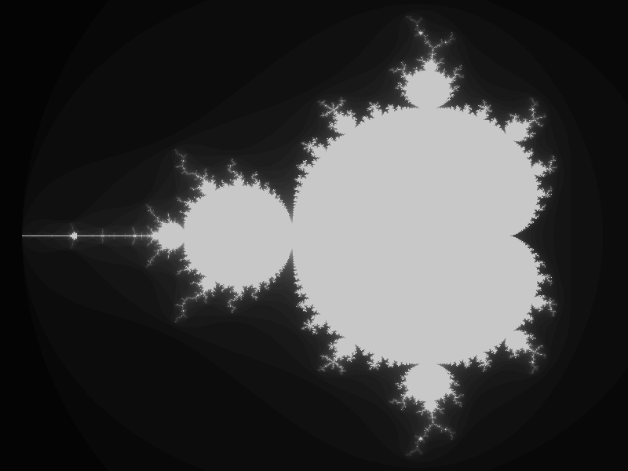
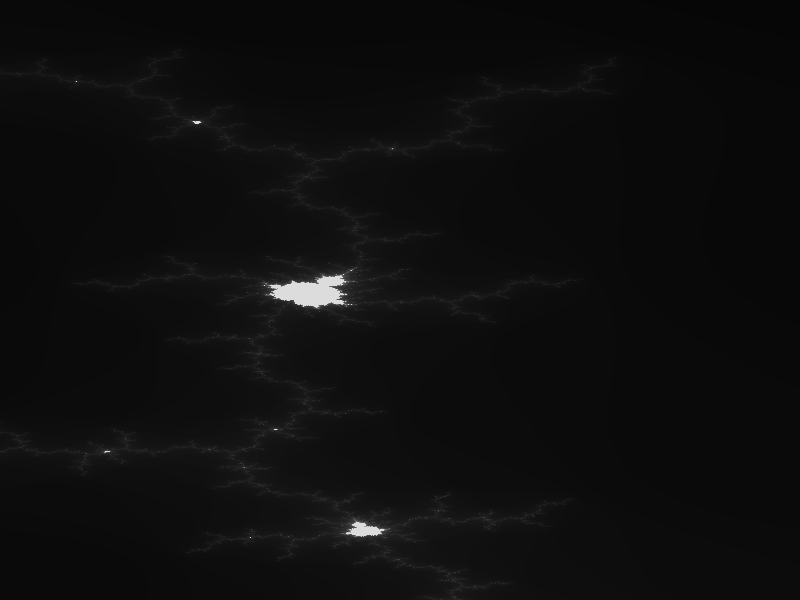

## Conjunto de Mandelbrot

El conjunto de Mandelbrot, investigado por [Beniot Mandelbrot](https://es.wikipedia.org/wiki/Beno%C3%AEt_Mandelbrot) cuando estudia la transición hacia el caos en los sistemas clásicos, es uno de los más conocidos ejemplos de [fractales](https://es.wikipedia.org/wiki/Fractal#:~:text=Un%20fractal%20es%20un%20objeto,naturales%20son%20de%20tipo%20fractal.) (estructura que se autoreplica en todas las escalas)

Se trata de una sencilla serie iterativa, aplicada en el plano complejo y que se define de esta forma:

$Z_{n+1} = Z^2_n + C$

con

$Z_0 = 0$

Se suele representar el resultado de la evolución para los valores de distintos valores de C: para los valores para los que $|Z_n| > 2$ la serie diverge y para los restantes se seuele representar con un color más claro cuánto mas tarda (el *n*) en empezar a diverger, o en blanco si no diverge.

Al representarlo gráfiamente nos encontramos con una figura muchísimo más compleja de lo que podíamos imaginar:



La sorpresa es aún mayor si ampliamos determinadas zonas y nos encontramos ¡pequeñas copia del conjunto de Mandelbrot completo!



Con este programa vas a poder navegar seleccionando con el ratón la zona que quieres ampliar.
* Puslando la tecla "s" se guardan las coordenadas actuales (todavía no se pueden cargar....)
* Pulsando la tecla "i" se guardar la imagen actual

[Código]()

```python

import pygame
import time

width = 1600//2
height = 1200//2
max_iteracion = 220
factor_color = 220 // max_iteracion

ROJO   = (255,   0,   0)

x0Min = -2.1
y0Min = -1.2
x0Max =  0.8
y0Max =  1.2

stepX = 1
stepY = stepX

def resetView():
    global  x0Min, y0Min, x0Max, y0Max 
    x0Min = -2.1
    y0Min = -1.2
    x0Max =  0.8
    y0Max =  1.2

def calculateFactors():
    global fx0, fy0, x0Min, y0Min, x0Max, y0Max 
    dx0 = x0Max - x0Min
    dy0 = y0Max - y0Min

    fx0 = dx0/width
    fy0 = dy0/height

    
def iteraMandelbrot(x0,y0):
    x, y = 0, 0
    iteracion = 0
    while iteracion < max_iteracion and x*x + y*y < 4 :
        xnew = x*x - y*y + x0
        y = 2*x*y + y0

        x = xnew
        iteracion += 1
       
    return iteracion


def init():
    global screen
    pygame.init()
    creaRangoColor()
    screen = pygame.display.set_mode((width,height))
    pygame.display.set_caption("Mandelbrot Set")

colores = [];
def creaRangoColor():
    for i in range(max_iteracion+1):
        colores.append(((max_iteracion -i)*factor_color, 0, i * factor_color))

def drawMandelbrot(i0=0,j0=0,stepI=1,stepJ=1,clear = False):
    global screen,fx0,fy0,x0Min,y0Min
    if clear:
        screen.fill((0,0,0))

    for i in range(i0,width,stepI):
        for j in range(j0,height,stepJ):
            x0 = i*fx0 + x0Min
            y0 = j*fy0 + y0Min

            iteracion = iteraMandelbrot(x0,y0)
           
            color = iteracion * factor_color
            screen.set_at((i,j), (color,color,color))
            #screen.set_at((i,j), colores[iteracion])
            

        pygame.display.flip()
        

def repintaZona():
    global fractal
    calculateFactors()
    screen.fill((0,0,0))
    drawMandelbrot()
    fractal = screen.copy() 

def refrescaPantalla():
    screen.blit(fractal, (0,0))
    pygame.display.flip()

def main():

    init()
    repintaZona()

    running = True
    bDrawRect = False
    rectangle_draging = False
    rectangle = pygame.Rect(0,0,0,0)
    while running:
        for event in pygame.event.get():
            if event.type == pygame.QUIT:
                running = False
            elif event.type == pygame.KEYDOWN:
                if event.key == pygame.K_ESCAPE:
                    running = False
                elif event.key == pygame.K_s:  # guardamos las coordenadas actuales
                    fichero = 'coordenas'+time.strftime('%Y%m%d-%H%M%S')+'.txt'
                    f = open(fichero,'wt')
                    str = f'x0Min:{x0Min}\n' + f'y0Min:{y0Min}\n' + \
                        f'x0Max:{x0Max}\n' + f'y0Max:{y0Max}\n'
                    f.write(str)
                    f.close()
                    print(f'Datos guardados en {fichero}')
                elif event.key == pygame.K_i:  # guardamos la imagen a fichero
                    fichero = 'imagen'+time.strftime('%Y%m%d-%H%M%S')+'.png'
                    pygame.image.save(screen,fichero)
                    print(f'Salvada imagen a {fichero}')
                elif event.key == pygame.K_r:  # volvemos al zoom original
                    resetView()
                    repintaZona()
            elif event.type == pygame.MOUSEBUTTONDOWN:
                if event.button == 1:
                    if rectangle_draging == False:
                        rectangle.x,rectangle.y = event.pos
                        rectangle_draging = True
            elif event.type == pygame.MOUSEBUTTONUP:
                if event.button == 1:            
                    rectangle_draging = False
                    # calculamos el rectangulos en coordenadas de pantlla
                    x1,y1 = event.pos
                    rectangle.width   = x1 - rectangle.x
                    rectangle.height  = y1 - rectangle.y
                    # guardamos los valores antiguos
                    x0MinOld, y0MinOld = x0Min,y0Min
                    # calculamos la nuevas coordenadas a dibujar
                    x0Min = rectangle.x * fx0 + x0MinOld
                    y0Min = rectangle.y * fy0 + y0MinOld
                    x0Max = (rectangle.x + rectangle.width)  * fx0 + x0MinOld
                    y0Max = (rectangle.y + rectangle.height) * fy0 + y0MinOld
                    # repintamos
                    repintaZona()
                    refrescaPantalla()
                    bDrawRect = False

            elif event.type == pygame.MOUSEMOTION:
                if rectangle_draging:
                    bDrawRect = True
                    x1,y1 = event.pos
                    rectangle.width   = x1 - rectangle.x
                    rectangle.height  = y1 - rectangle.y
                    
        if bDrawRect:
            screen.blit(fractal, (0,0))
            pygame.draw.rect(screen, ROJO, rectangle,width = 1) 
            pygame.display.flip()
            
    pygame.quit()

if __name__ == '__main__':
    main()

```