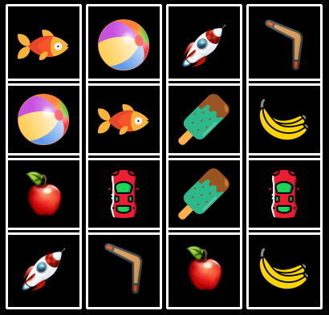

### Ejemplo: Juego de la vida

Vamos a hacer otro ejemplo de uso de PyGame, en este 
Recursos

Musica

https://freemusicarchive.org/music/sawsquarenoise/dojokratos/stage-3
Stage 3 by sawsquarenoise  https://creativecommons.org/licenses/by/4.0/
 
Sonidos de https://mixkit.co/free-sound-effects/game/

"""

pygame.mouse.get_pressed() devuelve estado de los 3 botones
(izd, central, derecho)

[Vídeo: Ejemplo de pyGame  con Objetos: Memory](https://drive.google.com/file/d/1AT-wUsef_aiZjlQ5hEpFG22KzSXTtctG/view?usp=sharing)

