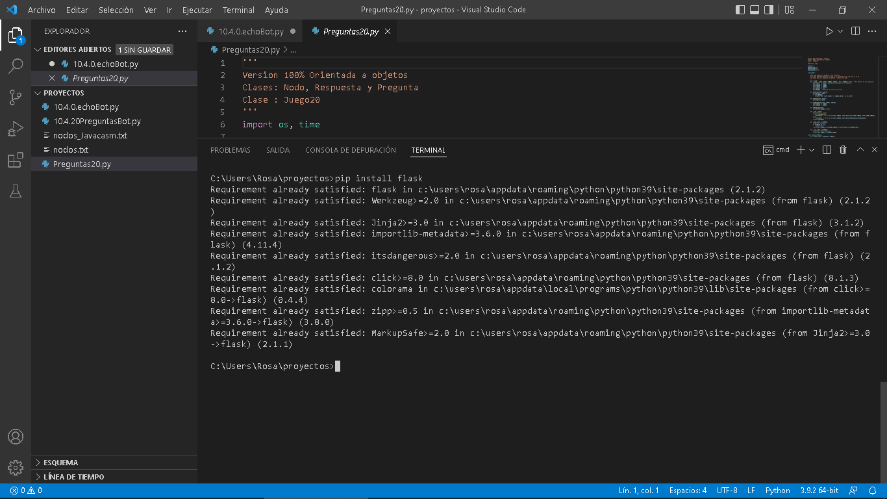

## Servidor Web con Flask

Vamos a ver ahora un ejemplo sencillo de servidor web que publica un contenido.

Tenemos diferentes alternativas para hacerlo:

* Usando [sockets](https://docs.python.org/es/3/howto/sockets.html) y [threads](https://docs.python.org/es/3/library/threading.html) donde trabajamos al  nivel más bajo.
* Usando las clases [http.server](https://docs.python.org/3/library/http.server.html), trabajaríamos a un nivel intermedio
* [Django](https://www.djangoproject.com/): se trata de un framework profesional y muy avanzado pensado para crear sitios web complejos.
* [Flask]: un framework sencillo y básico con el que podemos hacer muchas cosas de una manera simple.

Vamos a usar **Flask**, un framework de Python, sencillo y básico pensado para crear webs dinámicas de una forma sencilla. Decimos que es básico porque si bien nos permite crear páginas dinámicas, servicios webs, trabajar con templates,... no está diseñado para trabajar en modelos más complejos como el MVC (Master View Controller) ni integrarse fácilmente con el modelo relacional de bases de datos.

Flask, sí que incluye un servidor web propio y permite el uso y la depuración de todo el proceso.

### Primer ejemplo: "Hello Flask"

Vamos a crear una sencilla aplicación web: la típica Hello World, que llamaremos "Hello Flask" ;)

Empezamos instalando flask. Si trabajamos desde el terminal ejecutaremos:

```sh
pip3 install flask
```

Si usamos Thonny lo instalaremos desde el gestor de paquetes.

Para trabajar aplicaciones web,crearemos una carpeta de aplicación "webApp" donde pondremos todos los ficheros necesarios:

```sh
mkdir webApp
```

y dentro creamos una versión de prueba de la aplicación en el fichero app.py

```python
from flask import Flask

app = Flask('Primera prueba de flask')

# la asociamos al directorio raíz del servidor web
@app.route('/') 
def index():
    return 'Hola Flask!'

if __name__ == '__main__':
    # por defecto usará la ip y el puerto 5000
    app.run(debug = True, host = '0.0.0.0') 

```

Al activar el modo debug, se activa también la recarga automática del código cuando lo modificamos, lo que facilita enormemente el desarrollo.

En las versiones 3.x de Thonny hay un error y no podemos usar el modo depuración, por lo que la última línea será:

```python
    ....
    app.run(debug = True, host = '0.0.0.0') 

```

[](https://drive.google.com/file/d/1wKd3zjA2WEep-ymDqO5ogEr3EqWUAtpN/view?usp=sharing)

[Vídeo: Ejemplo básico con Flask con Thonny](https://drive.google.com/file/d/1wKd3zjA2WEep-ymDqO5ogEr3EqWUAtpN/view?usp=sharing)


También podemos arrancar la aplicación web desde la consola con:

```sh
python3 app.py
```

Y nos avisa de que está funcionando
```
 * Serving Flask app "Primera prueba de flask" (lazy loading)
 * Environment: production
   WARNING: Do not use the development server in a production environment.
   Use a production WSGI server instead.
 * Debug mode: on
 * Running on http://192.168.1.76:5000/ (Press CTRL+C to quit)
 * Restarting with stat
 * Debugger is active!
 * Debugger PIN: 105-828-726
```

Probamos desde un navegador web a http://IP_ordenador:5000 donde hemos sacado la IP_ordenador del mensaje anterior que nos mostró flask al arrancar.

En este otro vídeo vamos a ver como usaremos flask desde Visual Studio, una herramienta más avanzada que thonny y que ahora veremos cómo instalar y configurar.

[](https://drive.google.com/file/d/1VN7jJxMg6xk0ccbSMSYc7GWSuIhzqXHD/view?usp=sharing)


[Vídeo: Aplicación web con Flask](https://drive.google.com/file/d/1VN7jJxMg6xk0ccbSMSYc7GWSuIhzqXHD/view?usp=sharing)

Dependiendo de la configuración de nuestro sistema puede que tengamos que instalar flask desde Visual Studio. Para ello ejecutamos un Terminal y desde la consola ejecutamos

```sh
pip3 install flask
```




#### Visual Studio para trabajar aplicaciones Web

Para trabajar con aplicaciones Web es muy importante que el IDE que usemos nos facilite el trabajo. Vamos a necesitar probar nuestro código, el funcionamiento de la app en el navegador así como el aspecto visual.

Vamos a ver en este vídeo cómo podemos utilizar Visual Studio para trabajar aplicaciones Web, usaremos el entorno para probar la aplicación. En el vídeo se ve cómo instalar una extensión que nos facilitaba ver la página web desde el una pestaña del propio entorno, pero desgraciadamente la extensión ya no está disponible por temas de seguridad. Se muestra otra extensión pero a día de hoy no sirve para depurar aplicaciones Flask, sino sólo páginas HTML. Por lo tanto tendremos que usar el navegador para comprobar el funcionamiento y aspecto de nuestras página web con flask.


[](https://drive.google.com/file/d/12xIzWEXdZbrYZllX9GOLF18pKB_z0ze6/view?usp=sharing)


[Vídeo: Usando Visual Studio para trabajar con aplicaciones web con Flask](https://drive.google.com/file/d/12xIzWEXdZbrYZllX9GOLF18pKB_z0ze6/view?usp=sharing)


#### Ejemplo de uso de datos del usuario: Suma

Vamos a hacer ahora una sencilla web en la que tomaremos los datos que el usuario ponga en un formulario y mostraremos el resultado de la suma. Generamos el HTML desde el mismo código Python.

Este es el fichero de código que podemos llamar [app.py](https://raw.githubusercontent.com/javacasm/CursoPython/master/codigo/webApp/app.py):


```python
@app.route('/suma',methods = ["GET", "POST"])
def suma():
    htmlCode = ""
    if request.method == "POST":
        print("POST") # Obtenemos datos y calcula
        sumando1 = int(request.form.get("Sumando1"))
        sumando2 = int(request.form.get("Sumando2"))
        htmlCode = '''<html><head><title>Suma</title></head><body>
                      <h2>{} + {} = {}</h2>
                      <body><html>'''.format(sumando1,sumando2, str(sumando1 +sumando2))
    else:
        print("GET") # Mostramos HTML
        htmlCode = '''<html><head><title>Suma - resultado</title></head><body>
                <form action="/suma" method="POST">
                <label>Sumando 1:</label>
                <input type="text" name="Sumando1"/>
                <label>Sumando 2:</label>
                <input type="text" name="Sumando2"/><br/><br/>
                <input type="submit"/>
                </form>
                <body><html>'''
    return htmlCode

```

[](https://drive.google.com/file/d/1CIG9P-fbr4lVTuZASkjI7c9IwEg-Z3G-/view?usp=sharing)

[Vídeo: Ejemplo sencillo de App Web con formulario usando  Flask](https://drive.google.com/file/d/1CIG9P-fbr4lVTuZASkjI7c9IwEg-Z3G-/view?usp=sharing)


