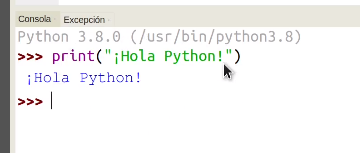
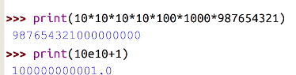

## Primer programa: ¡Hola Python!

Vamos a empezar usando la consola REPL (a veces diré consola, otras REPL). Su propio nombre indica REPL (Read-Eval–Print Loop): es un bucle que lee nuestro código, lo evalúa y muestra el resultado continuamente. Cuando trabajamos así estamos usando el intérprete de Python en modo interactivo.

Nos va a permitir probar y ejecutar nuestro código de un modo interactivo. Yo lo uso para probar fragmentos de código que luego voy a introducir como parte de un programa.

Cuando nos referimos a un programa python, estamos hablando de un fichero, normalmente con extensión **.py**, donde hemos incluido órdenes para que se ejecuten de manera consecutiva. Cuando Python ejecuta uno de estos ficheros no funciona en modo interactivo, sino que ejecuta todas las órdenes del fichero hasta terminarlas todas.

### Usando la consola

Todo lo que vamos a hacer en la consola de Thonny podríamos hacerlo en una consola de python cualquiera. La ventaja de Thonny es que ya nos da todo integrado y facilita enormemente el arrancar. En los sistemas que tienen Python integrado, como por ejemplo Linux, si escribimos en cualquier shell "python3", accedemos a la REPL de Python.

Entramos en la consola de Thonny (recuerda comprobar que tenemos al menos una versión 3.9, si no es así entra ejecutando python3)
 
y ponemos tras el prompt "**>>>**"

```python

print("¡Hola Python!")

```

Al pulsar la tecla Enter veremos que aparece en pantalla el texto

```
¡Hola Python!
```
 



En la imagen vemos que nos resalta la sintaxis, indicando con colores distintos cada parte del código.

También vemos en la imagen que aparece la versión del intérprete de Python que estamos usando.

También podemos hacer que se impriman números pero en  este caso no son necesarias las comillas. 

```python
print(314)
print(3.14)
```

Podemos usar números enteros o decimales, usando el punto decimal "**.**" como separador.

Incluso podemos poner operaciones ...

```python
print(314 + 50)
```

Podemos hacer cálculos con muchas cifras y Python se porta realmente bien, incluso podemos usar notación científica:



 
¿Qué ocurre si ponemos?

```python
print("314 + 50")
```

La diferencia está en que al poner las comillas estamos diciéndole que muestre ese contenido literalmente, si no ponemos las comillas intenta evaluar la expresión. 

[](https://youtu.be/xhNefGkhjtU)

[Vídeo: Nuestro primer código Python "Hola Python"](https://youtu.be/xhNefGkhjtU)

### Ejercicio Propuesto

1. Modifica este código para que imprima otro texto diferente
