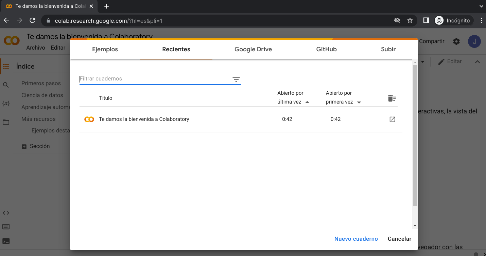
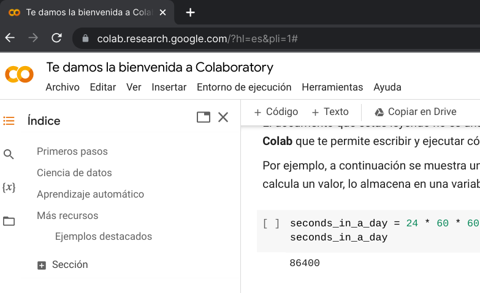
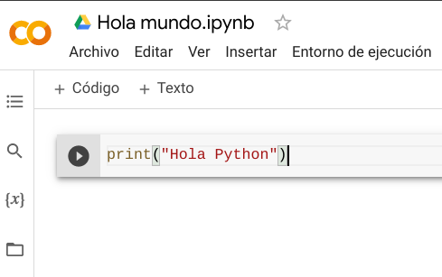
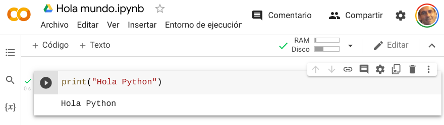
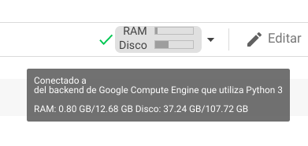
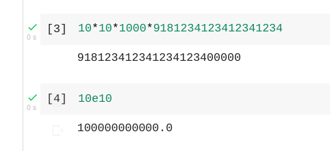
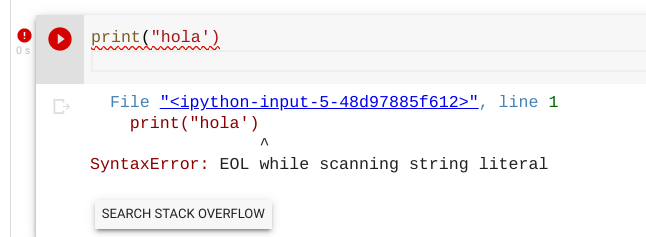

## "Hola Mundo" con Google Colab

Para empezar con Google Colab necesitamos una cuenta de gmail. Desgraciadamente a día de hoy los correos corporativos de Google Suite de EducaAnd no los incluyen entre sus aplicaciones.

Para empezar entraremos en la [página de Colab](https://colab.research.google.com/?hl=es) e iniciamos sesión con nuestro usuario de correo de Gmail. Una vez dentro nos encontramos con un documento de bienvenida:



En este documento tenemos un tutorial, con vídeos, para aprender a usar Google Colab:



### Primer programa: ¡Hola Python!

Es una costumbre de todo programador novato, que el primer programa ha de mostrar en pantalla un saludo.

Para crear nuestro primer documento Colab:

* Pulsamos en el botón “Nuevo Cuaderno” o desde el menú “Archivo” -> “Nuevo Cuaderno” y veremos un nuevo documento que recuerda bastante a los de Google Suite.
* Pulsamos sobre el nombre del documento “Untitled0” y lo renombramos por “Hola Mundo”
* Escribimos nuestra primera línea de código:

```python
print("Hola Python")
```

que significa: Muestra en pantalla el texto entre comillas (podemos usar comillas simples  ‘...’  o comillas dobles “....” pero en cada texto del mismo tipo)




* Ahora pulsamos el círculo con el signo Play y nuestro código se ejecutará, mostrando el texto que había entre comillas. También podemos ejecutar el código pulsando Ctrl+Enter:



Cuando ejecutamos por primera vez vemos que se muestra un mensaje de “Conectando con el servidor” y tras la conexión  aparecen los recursos que estamos consumiendo, en forma de memoria RAM y de almacenamiento en Disco:



Si dejamos el ratón encima nos muestra los límites que tenemos con nuestro usuario actual. Si necesitáramos más podemos contratarlo.

Si queremos cambiar el texto podemos tocar sobre el código y modificar la parte entre comillas.

Podemos añadir otra línea de código pulsando sobre “+ Código” y añadir código para mostrar distintos textos.

También podemos añadir textos que se mostrarán en nuestro documento. Podemos conseguir formatear el texto usando los botones del bloque de texto o un sencillo formato llamado Markdown.

Mezclando texto y código podemos conseguir generar documentos interactivos  de manera muy sencilla.

En la imagen vemos que en nuestro código nos resalta la sintaxis, indicando con colores distintos cada parte del código.

También podemos hacer que se impriman números,  en este caso no son necesarias las comillas y usaremos

```python
print(314)
print(3.14)
```

Podemos usar números enteros o decimales, usando el punto decimal “.” como separador.

Incluso podemos poner operaciones usando los tradicionales operadores aritméticos (usando el asterisco “*” para indicar multiplicación)

```python
print(314 + 50)
```

Podemos hacer cálculos con muchas cifras y Python se porta realmente bien, incluso podemos usar notación científica (10e6 para 1000000):



¿Qué ocurre si ponemos?

```python
print("314 + 50")
```

La diferencia está en que al poner las comillas estamos diciéndole que muestre ese contenido literalmente, si no ponemos las comillas intenta evaluar la expresión.

### Errores de sintaxis

Vamos a ver con un poco más de detalle: Hemos usado la función (más adelante veremos qué es una función, pero me gusta ir adelantando términos para que se vayan fijando) print() con comillas simples ‘..’ el texto que queremos que aparezca. También podemos usar comillas dobles “..”. ¿Por qué esta variedad?, creo que por motivos históricos pero ahora nos permite hacer cosas como estas:

```python
print('Hola "Python"')
print("Hola 'Python'")
```

Siempre tenemos que tener cuidado de que las comillas funcionan como los paréntesis en matemáticas: El último en abrir el primero que tengo que cerrar. Por tanto no podemos alternar los tipos.

¿Y qué ocurre si no hacemos? Pues que se genera un error de sintaxis, también si nos olvidamos de poner alguna, o no cerramos los paréntesis….



Afortunadamente Colab nos ayuda resaltando nuestro código y si nos olvidamos de cerrar una cadena, nos lo indica marcando toda la línea en rojo. También se producen errores cuando ponemos alguna operación matemática incompleta.

### Uso del editor de Colab

* Ya hemos visto que podemos editar cualquier línea escrita tanto de código como de texto o de su formato
* Podemos pulsar entre las bloques ya escritos y añadir contenidos de cualquier tipo
* Igual que con cualquier documento de Google Suite, podemos copiarlo o compartirlo con otros usuarios, o ver el historial de cambios.
* También podemos descargar desde “Archivo” -> “Descargar”
