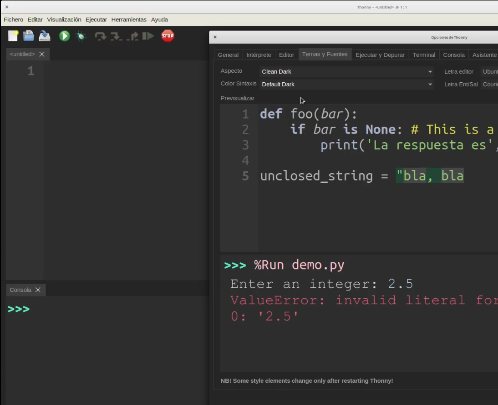

## Uso de Thonny

Vamos a repasar ahora algunas de las características de Thonny. Dejaremos la más avanzadas para cuando las necesitemos.

* La pantalla prinicipal está dividida en la parte central para el editor de código y otras pestañas alrededor. En la parte de abajo está la consola:
 

* Podemos abrir estas pestañas desde el menú **Visualización**
. Ahí están las ventas que más adelante nos permitirá ver los valores de las variables o la memoria.

* Hay una pestaña que sirve como navegador de archivos, desde donde podemos navegar por carpetas, crearlas o borrar ficheros.

* Ctrl + "+" y Ctrl + "-" aumenta o disminuyen el tamaño del tipo de letra

* Desde la barra de herramientas podemos **Abrir**, **Guardar** y **Nuevo** los ficheros de código. Junto a ellos están los iconos de **Ejecutar** y **Depurar**, con los que trabajaremos en breve. 

* En el menú **Edición** tenemos lo relacionado con **Copiar/Pegar** y algunas herramientas para el código que ya iremos viendo.

* En el menú **Herramientas** encontramos, las opciones para instalar paquetes Python y para instalar Complementos de Thonny

* También estn el menú **Herramientas** encontramos las **Opciones** que a su vez incluyen varias pestañas. Veamos algunas:
    * En la pestaña General podemos seleccionar el idioma y además yo le tengo puesto el **Factor de escalado UI** a 2.o para que el interface se vea más grande.
    
    * En la pestaña **Intérprete** podemos seleccionar la versión de Python qur usaremos. Normalmente se usa la "Incluída con Thonny" pero pudiera ocurrir que queramos usar otra
    
    Thonny nos permite programar Python para todo tipo de equipos, es decir podemos programar en Python dispositivos diferentes a un PC, como son **micro:bit**, **ESP8266** o **ESP32**, en los que usaremos una versión reducida de Python, llamada Micropython, pero este lo veremos en otro curso.
    * En la pestaña **Editor** configuramos cómo queremos que se resalte el código.
    * En **Temas y fuentes** seleccionamos el aspecto, tema, tanaño de letra, etc. 
    Cambiando el **Aspecto** y el **Editor** a Dark cambiaremos el aspecto de todo el entorno.

¿Cuál prefieres?

[Vídeo: Opciones y características del editor Thonny](https://youtu.be/hd6dod4mJWY)

 
