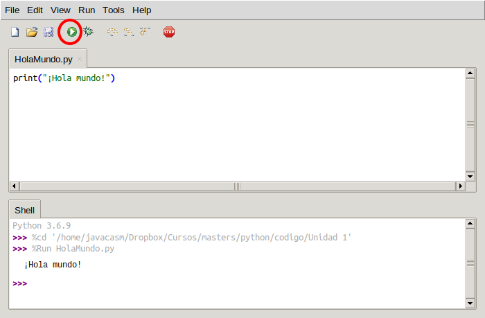

### Usando Ficheros para guardar nuestro código

Desde la consola podemos ejecutar cualquier cosa pero las órdenes que usemos se perderán al salir

Por ello vamos a ver cómo podemos trabajar con ficheros donde incluiremos todas nuestras órdenes

Desde Thonny podemos crear carpetas y si somos ordenados crearemos una llamada "Hello World" para poner dentro el fichero correspondiente. Creamos un nuevo fichero que guardaremos en esa carpeta como  **HolaMundo.py** con el siguiente contenido

```python
print("¡Hola mundo!")
```

Se suele utilizar la extensión **.py** para indicar que el fichero contiene código python

Vemos que el editor resalta la sintaxis indicándonos las distintas partes. Esto nos puede ayudar si hemos cometido un error. Por ejemplo  el editor Thonny nos resalta la línea si nos hemos olvidado de cerrar unas comillas


Desde el editor Thonny  también podemos ejecutar nuestro programa pulsando el botón **Ejecutar**



Veremos en la parte de la consola el resultado y después el prompt esperando un nuevo comando

Los programas en Python siempre se ejecutan desde la primera línea hasta la última y al llegar a esta terminan, no ocurre como en otros entornos (Arduino por ejemplo) donde el código se repite automáticamente. Si queremos que algo se repita se lo tendremos que decir explícitamente. 


[](https://youtu.be/snqeg5fV1mU)

[Vídeo: Trabajando con ficheros de código Python en Thonny](https://youtu.be/snqeg5fV1mU)

