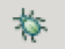
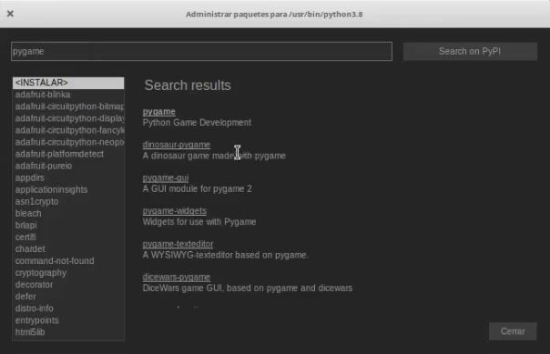

### Depuración

Durante el proceso de creación de nuestro código, cuando estamos trabajando con nuestro programa nos encontramos con la necesidad de depurar el código. Es decir, de encontrar los posible errores y revisar de una forma más o menos exaustiva todos aquellos pasos que se van dando.

Para ello es muy cómodo el uso de las funciones de depuración que nos facilitan el ejecutar nuestro programa paso a paso, es decir línea alínea e ir viendo en cada uno de estos pasos los valores que van tomando las diferentes variables y cómo van funcionando las distintas partes de nuestro programa.

Veamos las distintas opciones de depuración y los iconos para usarlas

Cuando ejecutamos normalmente nuestro programa, pulsando sobre el icono del "Play", estas funciones de depuración no se utilizar. 

Para usarlas tenemos que ejecutar nuestro código en **Modo Depuración**, pulsando sobre icono del "bichito verde" (por si quieres saber el [origen del término bug](https://es.wikipedia.org/wiki/Error_de_software))

Cuando estamos ejecutando un programa en modo depuración podemos hacer que nuestro código se vaya ejecutando línea línea usando la opción **saltando**.

Veremos que la línea actual se resalta

### Paquetes, pluggins y extensiones

Vamos a ver ahora cómo instalar módulos y paquetes desde Thonny, para ello vamos a descargar un fichero de un tema posterior del curso, para el que nos faltarán algunas dependencias.

Vamos a probar con el Juego de la Vida del tema 11. Descarga [este fichero](https://raw.githubusercontent.com/javacasm/CursoPython/master/codigo/11.5.pygameOfLife.py) y ábrelo con Thonny.

Cuando intentes ejecutar te dará un error de que no encuentra el paquete PyGame. 

Desde el menú **Herramientas** pulsa **Gestor de paquetes**

Y se abrirá el **Administrador de Paquetes**, escribe PyGame en el buscador e instálalo

Lo mismo te ocurrirá con el paquete numpy, que también tendrás que instalar.

Si te fijas además de instalar los paquetes que le hemos indicado, instala sus dependencias.

[Vídeo: Instalación de módulos desde Thonny](https://youtu.be/lbd1qWOajyU)

