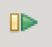

https://thonny.org/
https://realpython.com/python-thonny/

### Resolución de errores e instalación de módulos

A veces cuando ejecutamos un código nos encontramos con errores, vamos a ver cómo podemos ver dónde se producen y como resolverlos en el caso de que sea que nos falta algún módulo por instalar.

[Vídeo: Detección y solución de errores con Thonny](https://youtu.be/8U33Ngo6cZA)

### Depuración

Durante el proceso de creación de nuestro código, cuando estamos trabajando con nuestro programa nos encontramos con la necesidad de depurar el código. Es decir, de encontrar los posible errores y revisar de una forma más o menos exaustiva todos aquellos pasos que se van dando.

Para ello es muy cómodo el uso de las funciones de depuración que nos facilitan el ejecutar nuestro programa paso a paso, es decir línea alínea e ir viendo en cada uno de estos pasos los valores que van tomando las diferentes variables y cómo van funcionando las distintas partes de nuestro programa.

Veamos las distintas opciones de depuración y los iconos para usarlas

Cuando ejecutamos normalmente nuestro programa, pulsando sobre el icono del "Play", estas funciones de depuración no se utilizar. 

Para usarlas tenemos que ejecutar nuestro código en **Modo Depuración**, pulsando sobre icono del "bichito verde" (por si quieres saber el [origen del término bug](https://es.wikipedia.org/wiki/Error_de_software))

Cuando estamos ejecutando un programa en modo depuración podemos hacer que nuestro código se vaya ejecutando línea línea usando la opción **saltando**.

O podemos hacer que entre dentro de la ejecución de una línea que puede ser una función o puede ser un código un poquito más complejo usando la opción **entrando**.

Y una vez que estamos dentro de esta opción podemos decidir salir de ese punto en el que estamos con la opción **saliendo**.

También tenemos la opción **reanudar** que nos va a permitir el continuar con la ejecución de nuestro programa hasta hasta el siguiente punto de ruptura o hasta la finalización del mismo.

El icono **detener** nos va a permitir parar la ejecución o la depuración de nuestro programa

También son muy interesantes lo que se conocen como **puntos de ruptura** o **breakpoints** que son determinadas señales que incluímos dentro de nuestro código, cuando lo estamos depurando, para que la durante la ejecución esta se detenga en ese punto y así poder encontrar con mucho más precisión determinado punto del programa que queremos vigilar. Para activarlos o desactivarlos solo tenemos que hacer doble clic junto al número de la línea donde queremos establecerlo.

### Variables y sus valores

Mientras depuramos también podemos abrir la vista de variables que nos va a permitir seguir el valor que tienen las variables en cada momento.

[Vídeo: Depuración con Tonny](https://youtu.be/1ItV1pqIu1w)

### Paquetes, pluggins y extensiones

En este vídeo vamos a ver cómo instalar módulo y paquetes desde Thonny

[Vídeo: Instalación de módulos desde Thonny](https://youtu.be/lbd1qWOajyU)

## Referencia

[Curso de Aprende Python](https://aprendepython.es/devenv/thonny/#)

[Tutorial para empezar](https://realpython.com/python-thonny/)

### Para seguir  las novedades

En twitter @thonnyide

## Complmentos interesantes

[Thonny para programar el robot Edison](https://github.com/thonny/thonny-edison)