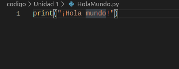
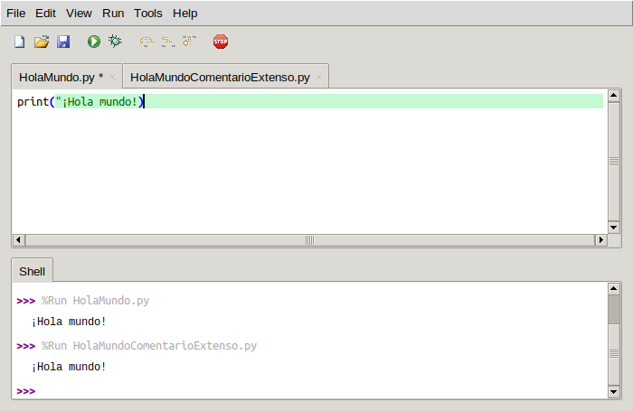
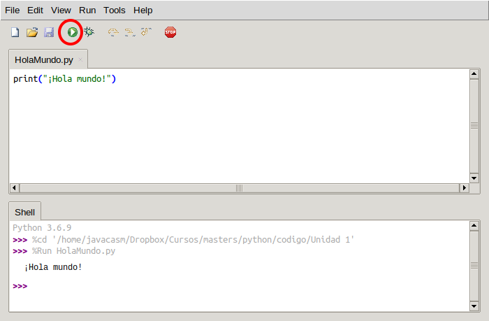

### Usando Ficheros para guardar nuestro código

Desde la consola podemos ejecutar cualquier cosa pero las órdenes que usemos se perderán al salir

Por ello vamos a ver cómo podemos trabajar con ficheros donde incluiremos todas nuestras órdenes

Vamos a crear una carpeta llamada  "Unidad 2" y ahí creamos un fichero **HolaMundo.py** con el siguiente contenido

```python
print("¡Hola mundo!")
```

Se suele utilizar la extensión **.py** para indicar que el fichero contine código python

En el IDE vsCode se ve así



Donde apreciamos que el editor resalta la sintaxis indicándonos las distantas partes. Esto nos puede ayudar si hemos cometido un error. Por ejmplo  el editor Thonny nos resalta la línea si nos hemos olvidado de cerrar unas comillas



Ahora vamos a ejecutar nuestro programa enuna consola y desde la carpeta **Unidad 2** donde hemos creado el fichero **HolaMundo.py** hacemos

```
python3 HolaMundo.py
```

(En algunos sistemas operativos el nombre de los ficheros es sensible a mayúscas/minúsculas por lo que tendrás que ejecutarlo tal y como lo creaste)

Y veremos el resultado


Dese el editor Thonny  también podemos ejecutar nuestro programa pulsando el botón **Run**




### Ejercicios

1. ¿Qué ocurre si añades otra sentencia **print("...")** después de la que ya tenemos?

