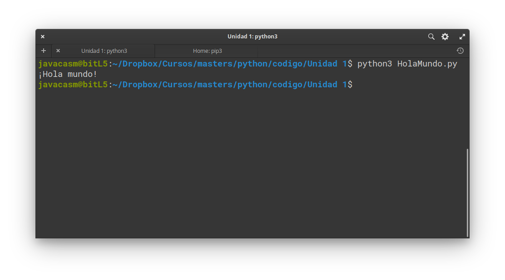

## Ejecución desde línea de comandos

Si tenemos instalado el intérprete de comandos independiente o nuestro sistema lo incluye, podemos 
```
python3 HolaMundo.py
```

(En algunos sistemas operativos el nombre de los ficheros es sensible a mayúsculas/minúsculas por lo que tendrás que ejecutarlo tal y como lo creaste)

Y veremos el resultado



