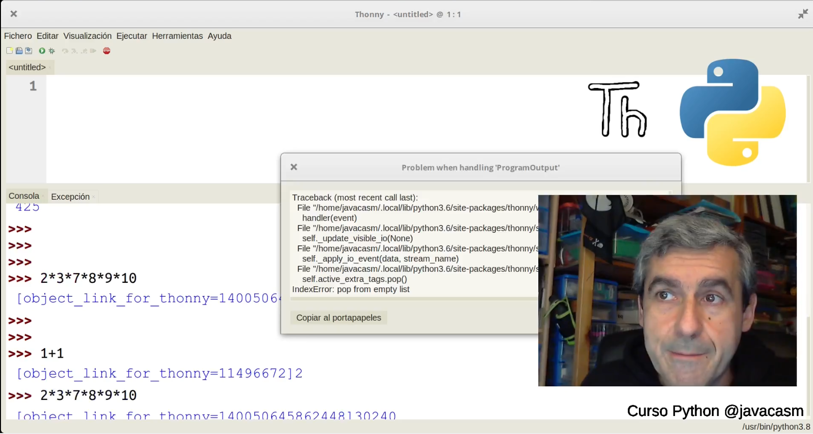
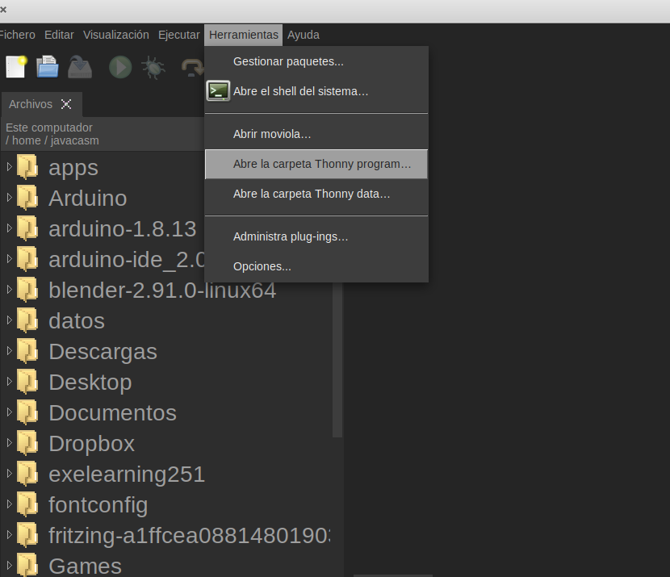
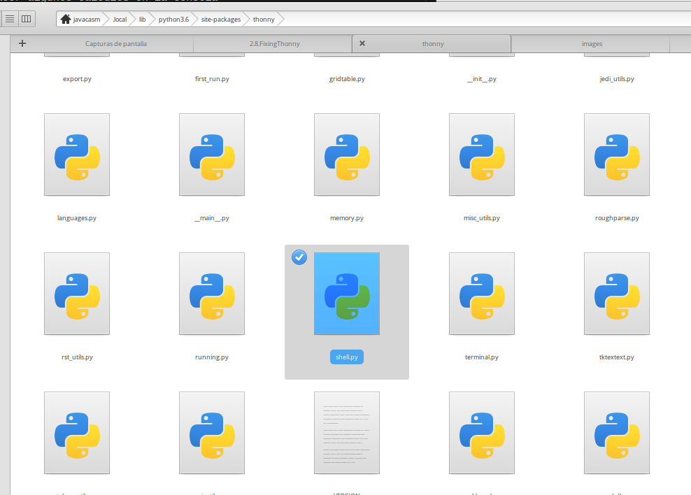

# Fixing Thonny

Lo bueno del open source, es que si te encuentras con un error puedes tratar de arreglarlo...

Y Thonny lo es, por eso vamos a tratar de arreglar que nos aparece en la versión 3.3.5 al hacer algúnos cálculos en la consola

En la ventana de error decía que se producía en la línea 555 del fichero shell.py.

Desde Thonny podemos abrir la carpeta donde está su código fuente (ya sabéis que Thonny está escrito en Python y lo que ejecutas es su código fuente)

En esa carpeta vamos a buscar el fichero shell.py y a ¡¡abrirlo con Thonny!!

En este vídeo vamos a ver el proceso de "parchear" el código para que no se muestre la ventana. No llegamos a arreglar el error...

[Vídeo: Intentando arreglar un error en el editor Thonny, ventajas del Open Source](https://drive.google.com/file/d/1ZX0pWaPgN3Ld3nB4uT7XvD3VW-nr5Xfa/view?usp=sharing)

Al buscar en el repositorio de [github de Thonny](https://github.com/thonny/thonny), encontramos que los desarrolladores están trabajando en el arreglo del error que ya ha sido reportado y que ya está en pruebas la siguiente versión que lo arregla. 