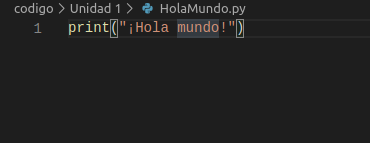
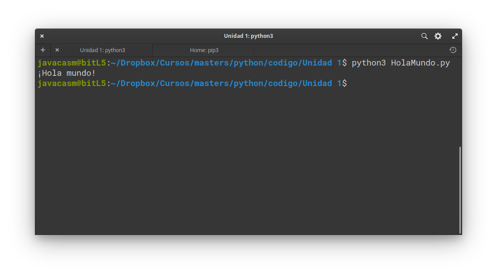

## Primer programa: Hola Mundo!

Nuestro primer programa

Entramos en la consola de python (recuerda comprobar que tenemos una versión 3.x, si no es así entra ejecutando python3)


y ponemos tras el prompt ">>>"

```python

print("¡Hola mundo!")

```
TODO: Comprobar que sale bien la admiración

Al pulsa la tecla enter veremos que aparece en pantalla el texto

```
¡Hola mundo!
```

Hemos usado la función **print()** indicando entre comillas **".."** el texto que queremos que aparezca

Desde la consola podemos ejecutar cualquier cosa pero las órdenes que usemos se perderán al salir

Por ello vamos a ver cómo podemos trabajar con ficheros donde incluiremos todas nuestras órdenes

Vamos a crear una carpeta llamada  "Unidad 2" y ahí creamos un fichero **HolaMundo.py** con el siguiente contenido

```python
print("¡Hola mundo!")
```

Se suele utilizar la extensión **.py** para indicar que el fichero contine código python

En el IDE vsCode se ve así



Donde apreciamos que el editor resalta la sintaxis indicándonos las distantas partes. Esto nos puede ayudar si hemos cometido un error. Por ejmplo  el editor Thonny nos resalta la línea si nos hemos olvidado de cerrar unas comillas


Ahora vamos a ejecutar nuestro programa enuna consola y desde la carpeta **Unidad 2** donde hemos creado el fichero **HolaMundo.py** hacemos

```
python3 HolaMundo.py
```

(En algunos sistemas operativos el nombre de los ficheros es sensible a mayúscas/minúsculas por lo que tendrás que ejecutarlo tal y como lo creaste)

Y veremos el resultado



Dese el editor Thonny  también podemos ejecutar nuestro programa pulsando el botón **Run**


### Comentarios

Ahora vamos a modificar el programa añadiendo un comentario. Un comentario es una indicación que se incluye en el código pero que sólo sirve para el programador, es decir no tendrá ningún efecto en el resultado del programa pero da información a quien lee el código

Si nuestro comentario sólo ocupa una línea (o parte de ella) sólo tenemos que añadir el carácter **#** y a partir de éste caracter el intérprete ignorará lo que hayamos escrito

```python
# Nuestro primer programa en python que muestra el mensaje ¡Hola mundo!
print("¡Hola mundo!")
```

Si queremos añadir un comentario que ocupe varias líneas podemos encerrar entre triples comillas dobles **"""** todo el texto

```python
""" 
Nuestro primer programa en python que muestra el mensaje ¡Hola mundo!
Escrito por @javacasm
23/03/2020
Licencia CC by sa
"""
print("¡Hola mundo!")
```

Si ejecutamos cualquier de las 3 versiones veremos que el resultado es exactamente el mismo

### Ejercicios

1. Modifica este programa para que imprima otro texto diferente
1. Añade comentarios de los tipos que hemos visto antes y después del texto
1. ¿Qué ocurre si añades otra sentencia **print("...")** después de la que ya tenemos?


