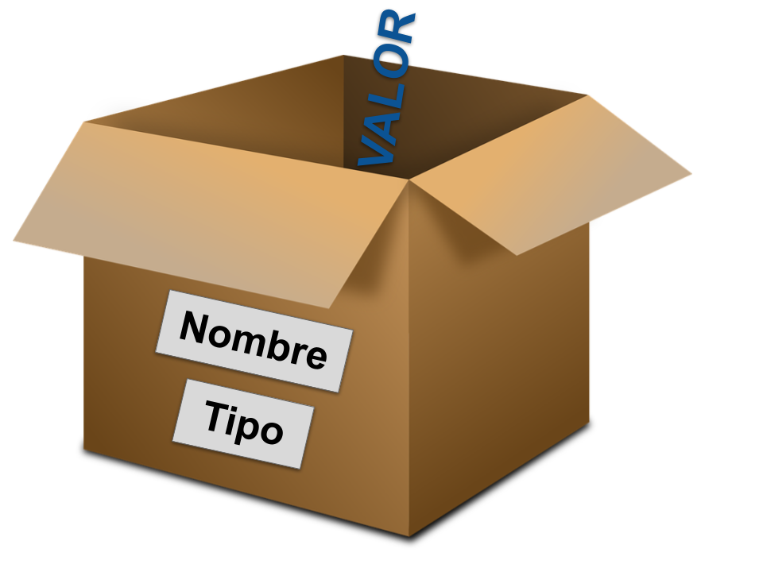

## Variables




En este tema vamos a empezar a trabajar con variables, que la forma que tenemos de almacenar datos en nuestro programa.

Podemos imaginar una variable como una caja a la que le damos un nombre y que es capaz de almacenar un valor, que puede cambiar. Las variables tiene también un tipo, que en Python viene definido por el valor que le damos.

Aunque no tenemos que decirlo explícitamente en Python las variables tienen tipo

En la siguiente línea estamos creando un variable y le damos el valor **Pepe**

```python
 persona = "Pepe"
 print("Hola")
 print(persona)
```

Llamamos asignación al hecho de dar a una variable un valor dado.

Diremos que hemos declarado la variable **persona** y le asignamos su valor.

Posteriormente podemos cambiar su valor sin más que asignarle otro nuevo.

Vemos cómo distinguimos cuando queremos imprimir un texto literal y el valor de la variable

Para indicar el valor de las variables de tipo texto podemos comillas simples **'** o dobles **"** 

Los nombres de las variables pueden estar formados por letras (mayúsculas y minúsculas, entre las que se distingue), números y el signo "_" de guión bajo, pero no pueden contener espacios, ni empezar con números. Se recomienda que no se usen letras con acentos o ñ, si bien todo esto depende más del editor que usemos y cómo codifique el fichero. 

Se recomienda  usar nombres claros y descriptivos. Podemos usar guión bajo o separarlas por las letras mayúsculas/minúsculas (a esta técnica se la llama [camelCase](https://es.wikipedia.org/wiki/Camel_case)). Por ejemplo:

```python
nombrePersona = "Pepe"
```
ó
```python
nombre_persona = "Pepe"
```

De la misma forma, aunque no es obligatorio se suele espaciar las asignaciones y las operaciones para hacerlos más legibles

### Palabras reservadas

 Existen ciertas palabras que tiene otro uso en python y no podemos usarlas como nombres de variables. Puedes encontrar el listado [aquí](https://www.programiz.com/python-programming/keywords-identifier) para la versión 3.7 de python

|Palabras |reservadas| en python|||
|---|---|---|---|---
|False|	await|	else|	import|	pass|
|None	|break	|except	|in	|raise|
|True	|class	|finally	|is	|return|
|and	|continue	|for	|lambda|	try|
|as|	def|	from	|nonlocal|	while|
|assert|	del	|global|	not	|with
|async|	elif	|if	|or	|yield

Podemos ver la lista de las palabras reservadas para nuestra versión de Python usando **help('keywords')**


[](https://drive.google.com/file/d/1y66wYVMOQGqYlWohoyuHT7T40pwzZbn2/view?usp=sharing)

[Vídeo: Variables y su uso en Python](https://drive.google.com/file/d/1y66wYVMOQGqYlWohoyuHT7T40pwzZbn2/view?usp=sharing)


