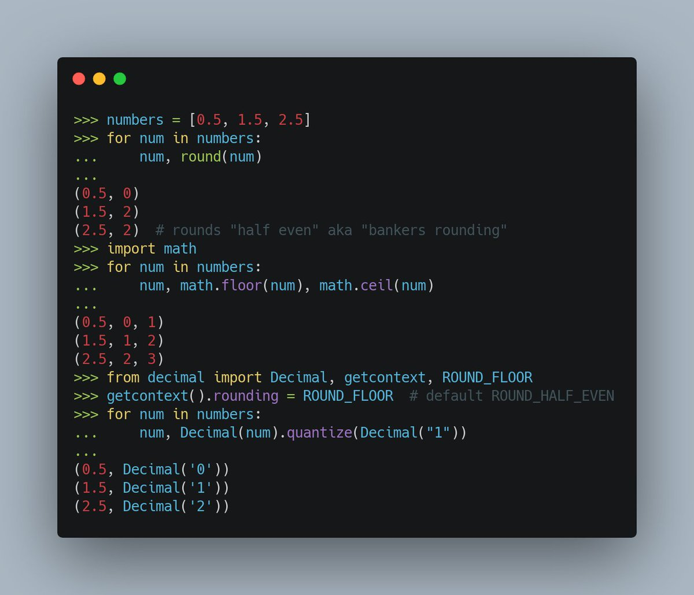

# x.OperadoresAritmeticos

TODO: Lo incluiría en la parte de uso desde de la consola

|Operador||
|---|---
|+| suma
|-|resta
|/|división (con decimales)
|//|división entera
|%|módulo o resto de una división
|**|potencia

## Redondeos

round()

math.floor()

math.ceil()

## Errores y excepciones

## Operaciones con cadenas

Suma

producto