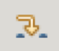
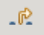
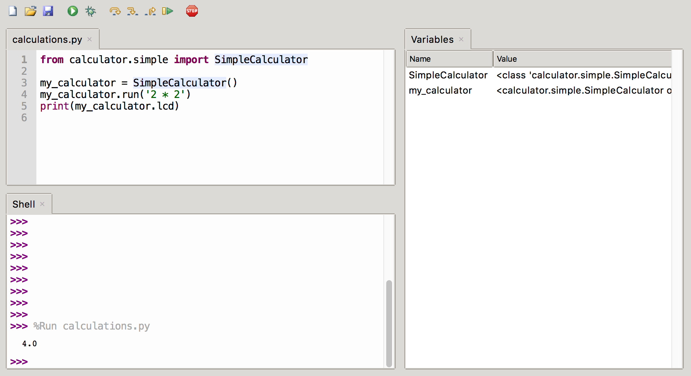

O podemos hacer que entre dentro de la ejecución de una línea que puede ser una función o puede ser un código un poquito más complejo usando la opción **entrando**.

Y una vez que estamos dentro de esta opción podemos decidir salir de ese punto en el que estamos con la opción **saliendo**.

También tenemos la opción **reanudar** que nos va a permitir el continuar con la ejecución de nuestro programa hasta hasta el siguiente punto de ruptura o hasta la finalización del mismo.

El icono **detener** nos va a permitir parar la ejecución o la depuración de nuestro programa

También son muy interesantes lo que se conocen como **puntos de ruptura** o **breakpoints** que son determinadas señales que incluímos dentro de nuestro código, cuando lo estamos depurando, para que la durante la ejecución esta se detenga en ese punto y así poder encontrar con mucho más precisión determinado punto del programa que queremos vigilar. Para activarlos o desactivarlos solo tenemos que hacer doble clic junto al número de la línea donde queremos establecerlo.

### Variables y sus valores

Mientras depuramos también podemos abrir la vista de variables que nos va a permitir seguir el valor que tienen las variables en cada momento.

[Vídeo: Depuración con Tonny](https://youtu.be/1ItV1pqIu1w)
