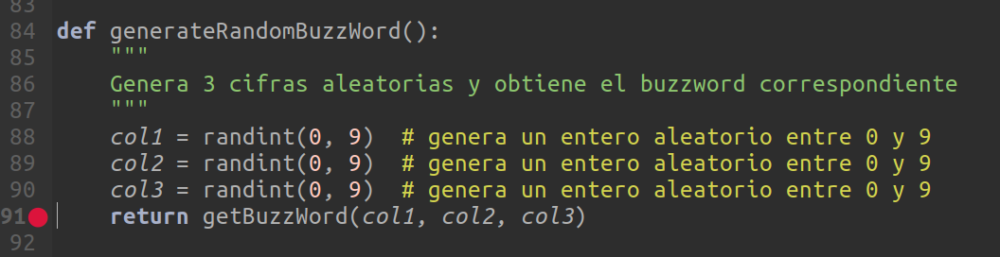

## Bucles 


En todos los programas necesitamos que partes de nuestro código se repitan. De hecho todos los programas/aplicaciones tienen una parte que llamamos bucle principal (main loop) que es donde el programa se pasa casi todo el tiempo.

Un bucle siempre está formado por un bloque de código que se repite y por una condición que decide si ha de repetirse una vez más o se termina.

Tenemos 2 formas de hacer un bucle en Python:

* Bucle **while** cuando tenemos claramente definida la condición que se debe cumplir para que se repita

* Bucle **for** para cuando tenemos claramente definidas las repeticiones que vamos a hacer o sabemos los elementos a los que vamos a aplicar nuestro código: Por ejemplo vamos a revisar todas las palabras de un texto, o todas la letras de una palabra.

En cualquier caso, en muchas ocasiones se pueden usar los dos con pequeñas diferencias.

Podemos detener un bucle usando en cualquier momento **Ctrl + C**

[](https://drive.google.com/file/d/1nBYF5jCvOEg_SVdvi_OOyFvYjfNmtnOO/view?usp=sharing)

[Vídeo: Repetición de código con bucles en Python](https://drive.google.com/file/d/1nBYF5jCvOEg_SVdvi_OOyFvYjfNmtnOO/view?usp=sharing)


### Bucle **while**

Hemos dicho que está indicado cuando existe una condición que nos dice que tenemos que repetir unas sentencias. Pondremos después de la palabra reservada **while** la condición de repetición, seguida de ":" que marcarán el comienzo del bloque que se va a repetir, con la indentación adecuada.

En este primer ejemplo vamos a contar hasta 100, imprimiendo los números. Usaremos una variable que hará como contador, que imprimiremos e incrementaremos a cada paso. La condición será que ese contador sea menor o igual a 100

```python
# imprimimos los 100 números
contador = 1
while contador <= 100:
    print(contador)
    contador += 1
```
Vamos a modificar ahora el ejemplo anterior para que muestre sólo los números que son múltiplos de 7 hasta el número 100, para lo que añadimos una sentencia condicional que sólo mostrará el valor de contador si es múltiplo de 7.

Vemos cómo hemos creado distintos bloques de código con la correspondiente indentación.

```python
# imprimos los múltiplos de 7 hasta 100
contador = 1
while contador <= 100:
    if contador % 7 == 0:
        print(contador)
    contador += 1
```

### Depuración en bucles

Vamos a aprovechar estos programas para utilizar las funciones de depuración. Veamos los restantes iconos de la barra de depuración y su utilidad.


O podemos hacer que entre dentro de la ejecución de una línea que puede ser una función o puede ser un código un poquito más complejo usando la opción **entrando**.


Y una vez que estamos dentro de esta opción podemos decidir salir de ese punto en el que estamos con la opción **saliendo**.


También tenemos la opción **reanudar** que nos va a permitir continuar con la ejecución de nuestro programa hasta hasta el siguiente punto de ruptura o hasta la finalización del mismo.


El icono **detener** nos va a permitir parar la ejecución o la depuración de nuestro programa




También son muy interesantes lo que se conocen como **puntos de ruptura** o **breakpoints** que son determinadas señales que incluímos dentro de nuestro código, cuando lo estamos depurando, para que la durante la ejecución esta se detenga en ese punto y así poder encontrar con mucho más precisión determinado punto del programa que queremos vigilar. Para activarlos o desactivarlos solo tenemos que hacer doble clic junto al número de la línea donde queremos establecerlo.


### Variables y sus valores

Como ya hemos visto, mientras depuramos también podemos abrir la vista de variables que nos va a permitir seguir el valor que tienen las variables en cada momento.


### Salir del bucle con **break**

A veces necesitamos detener la repetición de un bucle aunque la condición de repetición se siga cumpliendo. Para ello usaremos la palabra reservada (keyword) **break** que saldrá del bucle inmediatamente


Vamos a hacer ahora un programa que se detenga cuando encuentre el primer múltiplo de 77. Por tanto añadimos dentro del bloque la condición if de la sentencia **break**, que detendrá la ejecución.

Al tener dos maneras de terminar el bucle (porque ya no se cumpla la condición del while y porque llamamos a break), necesitamos una manera de distinguirlas. Para ello podemos añadir un bloque **else** que sólo se ejecutará si hemos salido porque ya no se cumplía la condición del while.

```python
# imprimos el primer múltiplo de 77
contador = 1
while contador <= 78:
    if contador % 77 == 0:
        print(contador)
        break
    contador += 1
else:
    print('No hay múltiplo')
print('Hemos terminado')
```
Podemos ver los diferentes comportamientos cambiando el valor del número hasta el que llegamos buscando el múltiplo de 77: llegando hasta 75 se mostrará la sentencia del else, mientras que si llegamos más allá del 77 se mostrará la línea anterior al break.

[](https://drive.google.com/file/d/1mYsuHziy4xOYfSOAq7sTiOgZjAnrq5P9/view?usp=sharing)

[Vídeo: Bucles While en Python](https://drive.google.com/file/d/1mYsuHziy4xOYfSOAq7sTiOgZjAnrq5P9/view?usp=sharing)

### Bucles infinitos

En algunas ocasiones no sabemos realmente la condición para detener un bucle, en ese caso diremos que hacemos un bucle infinito y saldremos del mismo por medio de una sentencia **break**

Vamos a hacer un programa que busque el múltiplo de 77 más cercano a 1000 y que sea menor. Para ello empezaremos en 1000 e iremos bajando hasta encontrarlo.

Como no sabemos a priori dónde para, pondremos una condición en while que se cumpla siempre: **while True** y pararemos con el break

```python
# buscar múltiplo de 77 más cercano y menor que 1000

contador = 1000

while True:  # bucle infinito
    if contador % 77 == 0:
        print(contador)
        break
    contador -= 1

```

Otra manera de hacerlo es utilizando una variable booleana en la condición, que valdrá True hasta que encontremos el número. De esta manera no tendremos que usar **break**

```python
# buscar múltiplo de 77 más cercano y menor que 1000

contador = 1000

repetir = True

while repetir:
    if contador % 77 == 0:
        print(contador)
        repetir = False
    contador -= 1

```

Realmente, en este se podría  hacer el bucle de una manera diferente para que la condición incluya la sentencia que va a desencadenar el break, pero en caso más complejos no va ser posible.

```python
# buscar multiplo de 77 mas cercano y menor que 1000

contador = 1000

while contador % 77 != 0:
    contador -= 1
else:
    print(contador)
```

Tenemos que tener cuidado con las condiciones para salir de los programas porque pudiera darse el caso en que éstas no se dieran nunca y el bucle no parara nunca, como es el caso de este programa

```python
# contador de 2 en 2 hasta 100

contador = 1

while True:  # bucle infinito
    if contador == 100: # Paramos al llegar a 100
        break
    print(contador)
    contador += 2
```

Para evitarlo sólo tenemos que modificar la condición de parada por una que nos lo asegure como sería **contador >= 100**

[](https://drive.google.com/file/d/1r89Z4CdzkxqCANL0lFFrPhkUqbpJtC4T/view?usp=sharing)


[Vídeo: Deteniendo la ejecución de bucles While con break](https://drive.google.com/file/d/1r89Z4CdzkxqCANL0lFFrPhkUqbpJtC4T/view?usp=sharing)


### Pidiendo datos "correctos" al usuario

Algo bastante frecuente cuando le pedimos datos al usuario es que puede fallar el formato de estos y que tengamos que volver a pedírselos hasta que sean válidos. 

Vamos a hacer un ejemplo de esto usando un bucle while (para repetir hasta que tengamos datos válidos) y un bloque try/except para validarlos


```python
pedirDatos = True
while pedirDatos:
    try:
        datoStr = input('Dame el número: ')
        datoInt = int(datoStr)
        # si llega aquí es que no ha saltado la excepción
        pedirDatos = False
    except: # ha ocurrido un error
        print('Debes dar un número entero válido')
print(f'Dato introducido {datoInt} ')
```

Repetiremos el bucle hasta que tengamos un dato entero válido

### Bucle for

Hemos dicho que el bucle **for** está pensado para recorrer conjuntos de cosas, como pueden ser palabras en una frase o las letras de una palabra. 

Por ello vamos a empezar haciendo un programa que nos deletrea una palabra

```python
# deletrear

cadena = input ('Introduce un texto:')
for letra in cadena: # vamos a ir recorriendo el texto letra a letra
    print(letra)    
```

Dentro del bucle **for** también podemos usar **break** igual que en **while**

Vamos a hacer ahora un programa que nos muestra todos los caracteres menos uno dado, la 'l' en estaco

```python
# deletrea palabras
cadena = input('Introduzca una palabra ')

for caracter in cadena:
    if caracter != 'l':
        print(caracter)
```

Tanto en el bucle **for** como el **while** tenemos un recurso para hacer que dentro de una iteración no se ejecuten algunas de las sentencias del bloque. Es la sentencia **continue** que pasará a la siguiente iteración saltándose las líneas del bloque que queden de esa iteración. 

Usándola el programa anterior quedaría:

```python
# deletrea palabras
cadena = input('Introduzca una palabra ')

for caracter in cadena:
    if caracter == 'l':
        continue  # repetimos desde aquí
    print(caracter)
```

### Range

Podemos usar también el bucle **for** cuando queremos iterar sobre números usando la función **range( )** (rango). Necesitaremos una variable que actúe de contador que será la que vaya recorriendo el rango.

A la función **range** le tenemos que indicar al menos 2 números: el inicio y el final, teniendo en cuenta que el final no se incluirá. Es decir, range(1,100) terminará en 99.

El programa para mostrar los números hasta 100 sería

```python
# contador hasta 100

for contador in range(1,101):
    print(contador)
```


También podemos darle un tercer argumento que será el incremento entre pasos, que por defecto es uno. Por ejemplo range(0,100,2) recorrerá los números pares desde el 0 hasta el 98


También podemos usar incrementos negativos, con lo que el rango se recorrerá en sentido descendente range(100,1,-1)


Y si queremos mostrar desde el 100 hasta el 1

```python
# contador hasta 100

for contador in range(100,0,-1):
    print(contador)
```

Podemos omitir el inicio de range si éste es 0, lo que nos permite simplificar. Por ejemplo si queremos repetir algo N veces, podemos hacer *for i in range(N):*

[](https://drive.google.com/file/d/1tdzWn95XMgfNbvCwTBAlTByW_tGbBCLb/view?usp=sharing)

[Vídeo: Bucle For: iterando entre secuencias de caracteres o rangos (range) de números](https://drive.google.com/file/d/1tdzWn95XMgfNbvCwTBAlTByW_tGbBCLb/view?usp=sharing)


## Bucles anidados

En algunas ocasiones necesitamos usar 2 bucles, uno dentro de otro para recorrer todas las posibilidades, por ejemplo si quisiéramos escribir las tablas de multiplicar enteras, necesitaríamos un bucle que cambia con cada tabla (la 1, la del 2, ...) y otro que cambia con el número dentro de cada tabla

Decimos que los bucles compuestos de esta manera están **anidados**.

Vamos a hacer el programa que nos muestra la tabla de multiplicar. Para recorrer la tabla usaremos la variable **i** (que vemos que está en el bucle exterior) y la **j** será la que recorra dentro de cada tabla. 

Añadiremos una indicación de la tabla que se está mostrando en cada momento.

```python
# tabla de multiplicar

for i in range(1,11):
    print(f'\nTabla del {i}\n------------')
    for j in range(1,11):
        print(f'{i} x {j} = {i*j}')
```

## Ejemplos

### Bucle while

Vemos en este ejemplo otra manera de calcular múltiplos

```python
# cálculo de múltiplos de 5 entre 1 y 1000


numero = 5
while numero<1000:
    numero = numero  + 5
    print(numero)

```

[Ejemplo while: 5.0 Múltiplos](./codigo/5.0.multiplos.py)


### Ejemplo bucle for

Vamos a ver en este ejemplo cómo podemos calcular a la vez si son múltiplos de 5 y de 7 usando un bucle **for**

```python
# cálculo de múltiplos de 5 y/o 7 entre 1 y 1000 usando bucle for

for numero in range(1, 1001):
    bMultiplo5 = numero % 5 == 0  # comprobamos si es múltiplo de 5
    bMultiplo7 = numero % 7 == 0  # comprobamos si es múltiplo de 7
    if bMultiplo5 and bMultiplo7 :
        print(f' {numero} es múltiplo de 5 y de 7')
    elif bMultiplo5 :
        print(f' {numero} es múltiplo de 5')
    elif bMultiplo7 :
        print(f' {numero} es múltiplo de 5 y de 7')

```
[Ejemplo bucle for v1](./codigo/5.0.multiplosFor.py)

Veamos ahora otra forma de hacerlo

```python
# cálculo de múltiplos de 5 y/o 7 entre 1 y 1000 usando bucle for

for numero in range(1, 1001):
    bMultiplo5 = numero % 5 == 0  # comprobamos si es múltiplo de 5
    bMultiplo7 = numero % 7 == 0  # comprobamos si es múltiplo de 7
    strMensaje = ''
    if bMultiplo5 or bMultiplo7 :
        strMensaje = f' {numero} es múltiplo'
        if bMultiplo5 : 
            strMensaje += ' de 5'
        if bMultiplo7 :
            strMensaje += ' de 7'
        print(strMensaje)
```

[Ejemplo bucle for v2](./codigo/5.0.multiplosFor_v2.py)


### Suma de números hasta N

Vamos a hacer ahora un mismo ejemplo usando los dos tipos de bucles. Calcularemos cuando vale la suma de todos los enteros hasta uno dado, N.

Para hacer el cálculo usaremos una variable que recorra el rango 1 hasta N, que generaremos con range(1,N+1) y otra que vaya acumulando la suma de todos los anteriores.


```python
# Sumas de enteros has N
N = int(input('¿Numero? '))

suma = 0
for sumando in range(1,N+1):
    suma += sumando

print(f'La suma hasta {N} es: {suma}')
print(f'Algebraicamente es {N*(N+1)//2}')
```

[codigo](./codigo/5.0.SumaNumeros.py)

Vamos a comprobar el resultado con el cálculo algebraico que sabemos que es N*(N+1)/2

Si ahora hacemos el programa con while, nos va a quedar muy parecido.

```python
# Sumas de enteros has N
N = int(input('¿Numero? '))

suma = 0
sumando = 1
while sumando <= N:
    suma += sumando
    sumando += 1

print(f'La suma hasta {N} es: {suma}')
print(f'Algebraicamente es {N*(N+1)//2}')
```

[](https://drive.google.com/file/d/1pHt-xhMxJZ2LpzqlsHvP7XwzZGFr8dkt/view?usp=sharing)

[Vídeo: Bucles for anidados en Python](https://drive.google.com/file/d/1pHt-xhMxJZ2LpzqlsHvP7XwzZGFr8dkt/view?usp=sharing)


