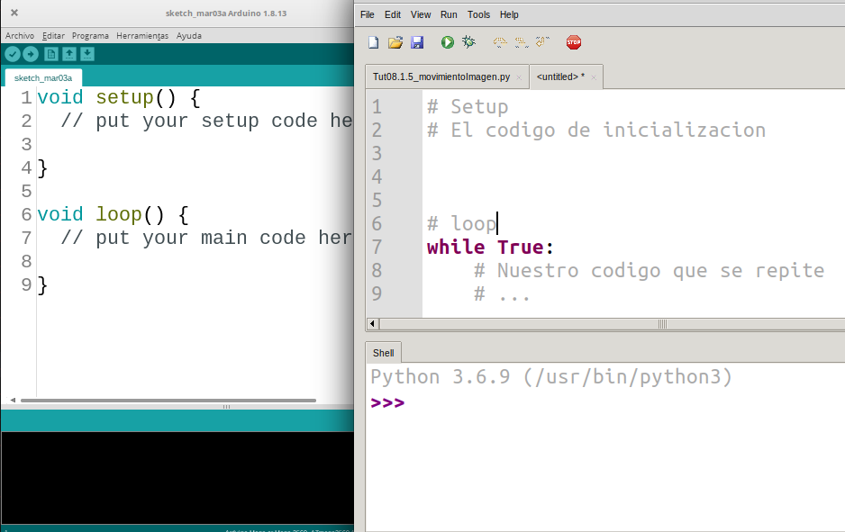

## Si vienes de Arduino...

Si no coneces Arduino te diré puedes saltarte esta parte sin problema, sólo te diré que es una placa programable para hacer proyectos electrónicos o de robótica. 

Los que utilizamos habitualmente Arduino estamos acostumbrados a que su código viene dividido en 2 partes: 
* **setup()** donde ponemos la parte de inicialización
* **loop()** donde está la parte de nuestro programa que se repite

```C++

void setup(){
    // Nuestro código de inicialización
}

void loop(){
    // el código que se repite
}
```

Como hemos visto hasta ahora en Python, en el código de nuestros programas no se ejecuta un bucle automáticamente. Pero ahora que ya sabemos hacer bucles sí que podemos hacer programas que se comporten de esa manera:

```python
# Setup
# Aquí ponemos el codigo de inicialización

# loop
while True:
    # Código del bucle.

```




