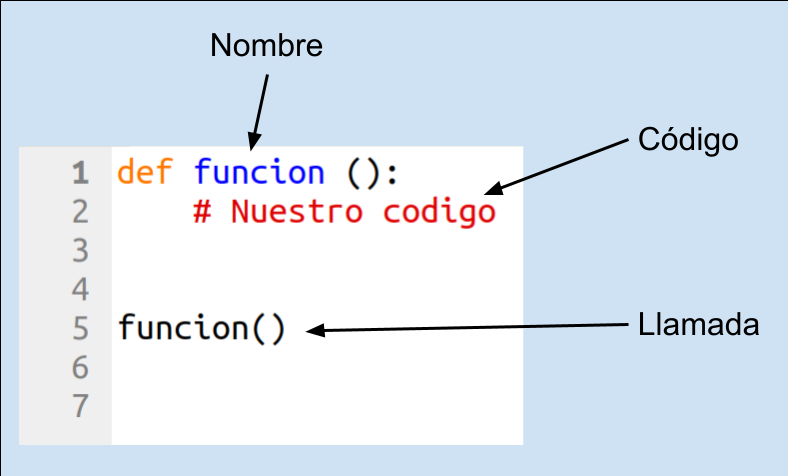
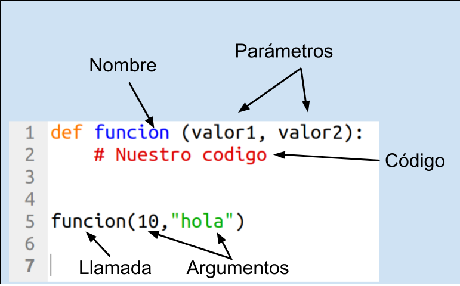
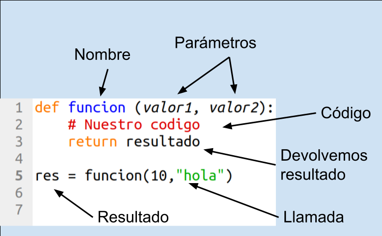
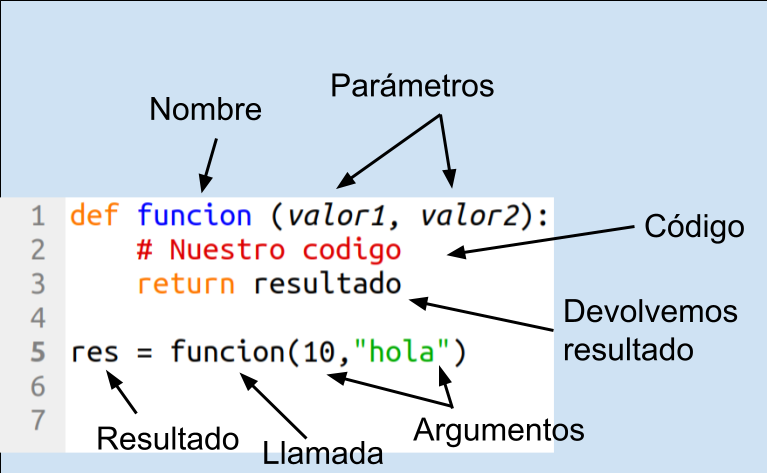

# Funciones



Una función es una estructura que nos va a permitir usar varias un bloque de código sin tener que repetirlo. 

La función tendrá un nombre y antes de usarla tenemos que definirla, lo que se hace precediendo el nombre de la función de la palabra reservada **def** y tras unos paréntesis pondremos ":" que nos indican que sigue nuestro bloque de código.

Pondremos el bloque de código indentado para dejar claro las líneas que lo forman.

Para usar la función, la  llamaremos lo que se hacen simplemente poniendo su nombre y los paréntesis.

Veamos un ejemplos sencillo de una función llamada "saludo" y que nos mostrará nuestro famoso "Hola Python"

```python
def saludo():
    '''
    Muestra un saludo en pantalla
    '''
    print('Hola Python')
```
La ejecutaremos con 

```python   
>>> saludo()
>>> Hola Python
```
Si documentamos la función incluyendo un comentario extenso al principio, además de incluir información de su uso, permitimos acceder a esa información desde el comando **help**

Ahora si usamos help(saludo), no dará la información que hemos incluído en el comentario

[](https://youtu.be/LqA916KCrqM)

[Vídeo: Funciones en Python](https://youtu.be/LqA916KCrqM)


## Parámetros y argumentos

Ya que tenemos una función que saluda, sería una buena idea que nos permitiera un poco más de flexibilidad al saludar, permitiéndonos hacer un saludo a cualquier persona.

Para ello vamos a añadir lo que se conoce como un parámetro, que es una variable entre los paréntesis de la definición y que podremos usar dentro de nuestro código




```python
def saludo(nombre = 'Python'):
    '''
    Muestra un saludo en pantalla
    
    param nombre: a quien saludamos
    '''
    print(f'Hola {nombre}')
```

nombre = 'Pepe'
saludo('Juan')
print(nombre)








Ya hemos visto algunas funciones de Python como print() que tiene parámetros, o input() o len() que tienen parámetros y además devuelven valores.

Creamos una función para luego usarla todas las veces que necesitemos, la llamaremos


### Documentación en funciones

Si documentamos la función incluyendo un comentario extenso al principio, además de incluir información de su uso, permitimos acceder a esa información desde el comando **help**

```python
def suma(sumando1, sumando2):
    '''
    suma: devuelve la suma de 2 valores
    
    param sumando1: primer sumando
    param sumando2: segundo sumando
    
    devuelve la suma
    '''
    resultado = sumando1 + sumando2
    return resultado
```

Ahora si usamos help(suma), no dará la información que hemos incluído en el comentario


## Indicación de Tipos en argumentos

Como ya vimos, a partir de la versión 3 de Python, podemos indicar el tipo que va a tener una variable. También podemos indicar el tipo que tendrá un argumento y el tipo de variable que devolverá la función.

```python
>>> def saludo(nombre: str) -> str:  
>>> # Esperamos un argumento de tipo str y devolvemos un str
>>>    return 'Hola ' + nombre
>>> saludo('pepe')
'Hola pepe'
>>> print(saludo('pepe'))
Hola pepe
>>> print(saludo(7))
Traceback (most recent call last):
  File "<pyshell>", line 1, in <module>
  File "<pyshell>", line 2, in saludo
TypeError: must be str, not int
```
Como vemos en el ejemplo en el caso de que no sea válido el tipo se produce una Exception de tipo TypeError


