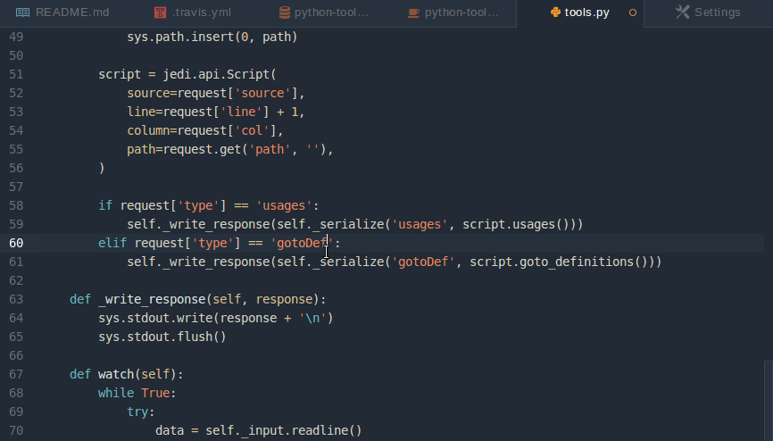
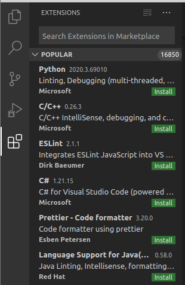

# Visual Studio Code

Vamos a introducir ahora una herramienta más avanzada que Thonny, se trata de Visual Studio code. Es el entorno de programación OpenSource de Microsoft que se puede usar con diferentes lenguajes.

Permite programar con diferentes lenguajes: Python, C, C++, Java, Arduino, ... incluso usando diferentes plataformas, por ejemplo Arduino con Plataform IO o herramientas de programación para Lego. Además integra herramientas de gestión de código como git y depuradores.

Para usar diferentes lenguajes y/o plataformas usaremos extensiones, que podremos instalar en cualquier momento.

## Instalación

Está disponible para los sistemas operativos más frecuentes: Windows, Linux, MacOS y para distintas arquitecturas, x86, amd64 y arm7 (Raspberry Pi).

Descargamos desde la [página de descargas](https://code.visualstudio.com/Download) la versión para nuestro sistema operativo.

Lo instalamos y procedemos a buscar las extensiones que usaremos para trabajar con Python. Pulsamos el icono de las extensiones  y buscamos la extensión para python

 

Tenemos que pulsar sobre **Install** para que la extensión se instale. Algunas de ellas requieren que reiniciemos Visual Studio.

En lugar de utilizar muchas barras de iconos, para acceder a las diferentes funcionalidades Pulsamos **F1** o **ctrl +  shift + P** y buscamos la opción que queremos usar, escribiendo en primer lugar el nombre de la extensión, por ejemplo para ejecutar un fichero de código Python, escribiremos "Python: Run"

[Vídeo: Visual Studio Code - Presentación](https://drive.google.com/file/d/1V1PmhysDqDITMhg1Lbp_eK12Z4TJ-aGL/view?usp=sharing)

Vamos a ver algunos de los diferentes usos que podemos darle, que son lo que lo hace mucho más útil que un mero IDE. Por ejemplo, yo lo he usado para escribir todo el material de este curso.

[Vídeo: Visual Studio Code - Usos](https://drive.google.com/file/d/1ugULmEZAnACfvo935x0PNsHOBHWlotkD/view?usp=sharing)

Para aprender más puedes ver el [Tutorial oficial de Python con Visual Studio Code](https://code.visualstudio.com/docs/python/python-tutorial)

