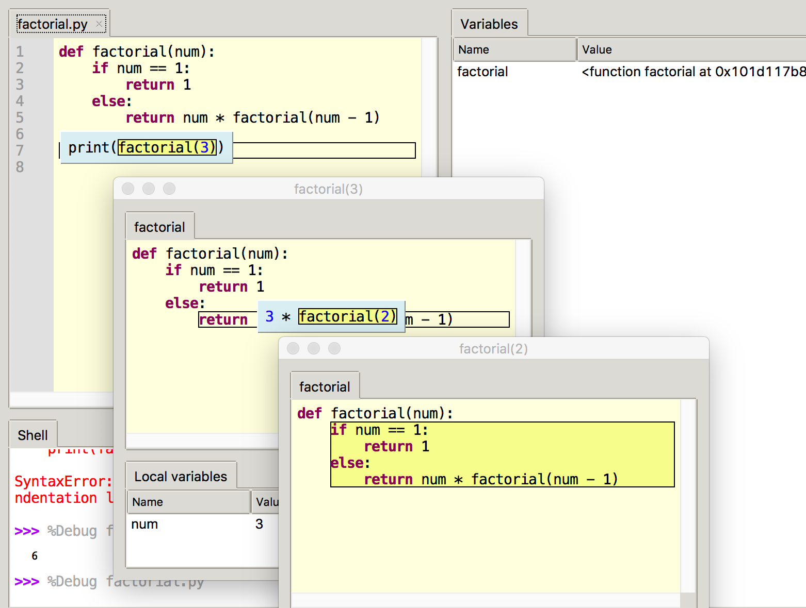
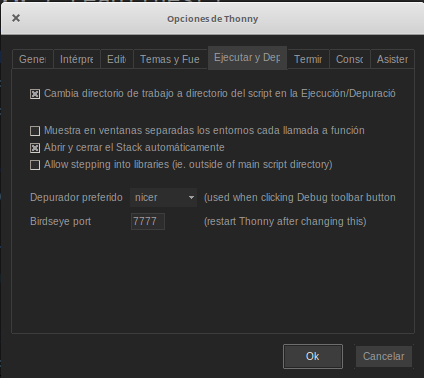

## Depuración de código con funciones con Thonny

A medida que vamos trabajando con programas cada vez más complejos, donde ya se van incluyendo funciones y otros elementos que hacen más difícil el seguimiento, cobran mayor importancia las opciones de depuración.

Thonny nos permite depurar, no solamente el código que vamos ejecutando, sino también nos va mostrando las diferentes funciones por las que estamos pasando de manera que podamos ir viendo como unas funciones llaman a otras.

[Vídeo: Depuración de Funciones con Thonny](https://youtu.be/NryBCZ2gNKw)

Por defecto cada vez que pasamos de una función a otra mientras depuramos, Thonny nos abre una nueva ventana, pero podemos cambiar este comportamiento y que siempre se use la ventana principal. Lo haremos de la ventana de opciones, en la pestaña Depuración

## Depuración con Visual Studio Code

[Vídeo: 6.0 Depuración con Visual Studio Code](https://youtu.be/LUz93c_7FYs)
