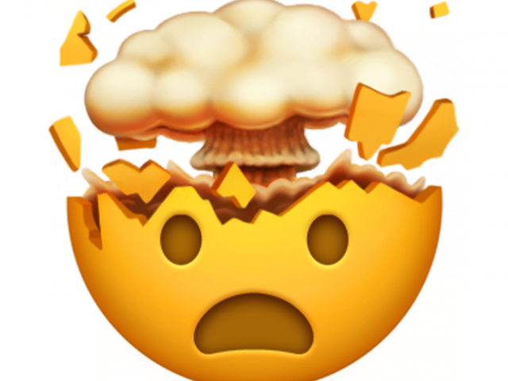

## Listas

TODO: moverlo 2.3

Una lista es un ¿sistema? que nos permite almacenar varios valores juntos.

Características:

* No tienen que ser todos del mismo tipo
* Pueden cambiar de tamaño

(Si has programado en otro lenguaje, te pueden recordar a los arrays, pero en python son mucho más dinámicas)

Para declararla lo haremos de la siguiente forma

```python

mi_lista = [ 10, "hola", "Pepe",25]

print(mi_lista[2])

```

Accederemos a cada elemento usando su posición, empezando  en 0 y terminando en el elmento N-1, siendo N el número de elementos de la lista. 

Podemos modificar el valor de cada elemento


```python

mi_lista = [ 10, "hola", "Pepe",25]

print("inicialmente",mi_lista[2])

mi_lista[2] = "Juan"

print("ahora es",mi_lista[2])

```

También podemos usar un índice negativo siendo **-1** el elemento de la última posición y así hasta llegar al primero.

Si intentamos acceder a un elemento más allá de la última o de la primera obtendremos un error que más adelante veremos llamado una **Excepción**

### SubListas

También podemos recuperar varios elementos de una lista, es lo que se llama una **sublista**. Para ello indicaremos un rango de valores, que son 2 valores numéricos separados por **principio:final**, siendo **principio** el índice del primer elemento de la sublista y **final**  el índice posterior al último que vamos a recuperar. 

```python
print(mi_lista[0:2])
```
obtendremos 
```
[10, 'hola']
```
Si omitimos el primer valor se entenderá que nos referimos al primer valor de la lista 

```python
print(mi_lista[:2])
```
obtendremos 
```
[10, 'hola']
```

y si omitimos el segundo que queremos llegar hasta el elemento final

```python
print(mi_lista[2:])
```

obtendremos 
```
['Juan', 25]
```

Si omitimos los dos tendremos la lista entera

```python
print(mi_lista[:])
```


obtendremos 
```
[10, 'hola', 'Juan', 25]
```

También podemos incluir un tercer número en la sublista (separado por otro **:**) que indicará cada cuantos elementos contamos al elegirlos (lo que sería el "paso"). Por defecto este número es 1, pero podría ser otro. 

```python
print(mi_lista[::2])
```
obtendremos 
```
[10, 'Juan']
```

Una utilidad de este tercer parámetros es invertir el orden de nuestra lista usando **-1**. Por ejemplo
```python
print(mi_lista[::-1])
```
obtendremos 
```
[25, 'Juan', 'hola', 10]
```



### Operaciones sobre listas

Si nuestra lista está formada por elementos homogéneos (todos números o todos texto) podremos realizar una serie de operaciones sobre ellas

mi_lista = ['Juan', 'Dionisio', 'Pepe', 'Manolo']

#### Ordenación


mi_lista.sort()


mi_lista.sort(reverse=True)

Una vez ordenada sabremos que el primero o el último serán el mínimo o el máximo valor

#### Funciones sobre listas

podemos obtener el máximo aplicando la función **max**

max(mi_lista)

el mínimo aplicando la función **min**

min(mi_lista)

O la longitud con **len**

len(mi_lista)

### Búsquedas

También podemos buscar en una lista con la palabra reservada **in**

Conviene destacar que se distingue entre mayúsculas y minúsculas

'Juan' in mi_lista

Una vez que sabemos que está podemos preguntar en qué posición con **index**

posicion = mi_lista.index("Juan")

También podemos contar el número de veces que se repete un valor con **count** 

mi_lista.count("Juan")

1

mi_lista.count("juan")

0

Como vemos podemos usar la función count para ver si un elemento está o no en una lista

### Edición en listas

Hemos visto cómo cambiar, buscar, contar o acceder a elementos de una lista. Pero se pueden hacer más operaciones como 

#### append
Añade un elemento a la lista

#### clear

#### insert

#### remove(index)

elimina el elemento **index** de la lista

podemos usar el "arcaismo" **del**

del lista[4]

#### copy

#### reverse

reverse(lista)


#### pop

Devuelve el último elemento de la lista y lo retira de la lista.


#### extend

une 2 listas 
¿igual que operador + ?

#### sort

Ordena la lista,

lista.sort() # Nos ordena la lista

Si tenemos una lista que mezcla números y letras nos dará un error.

Tambien podemos ordenar una lista con la funcion **sorted**

sorted(list)

Podemos hacer diversos tipos de ordenacion con 

reverse - If true, the sorted list is reversed (or sorted in Descending order)
key - function that serves as a key for the sort comparison


### Ejercicios

* Diferencia entre pop y remove
* ¿de donde viene **del**?


## Recursos

https://www.programiz.com/python-programming/list


