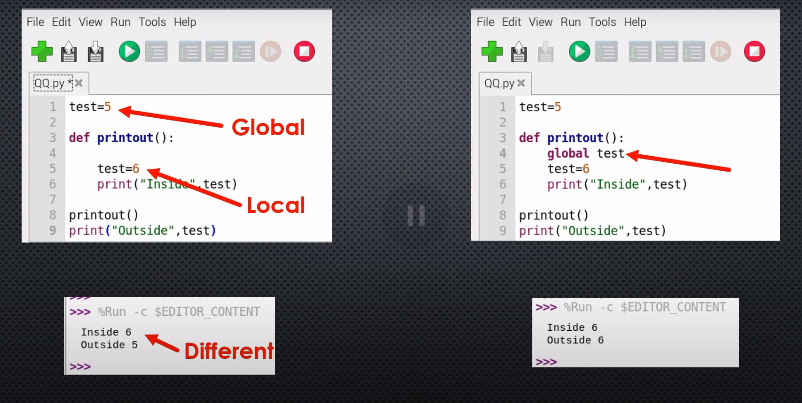

Variables locales y globales

palabra global

Explains scopes. Highlighting variable occurrences reminds you that the same name doesn't always mean the same variable and helps spotting typos. Local variables are visually distinguished from globals.

