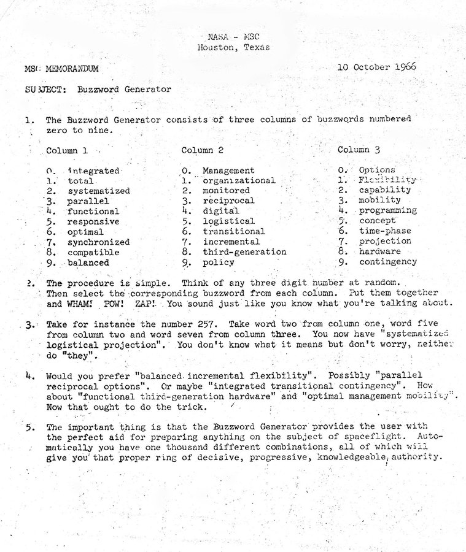

### Ejemplo de uso de tuplas: BuzzWord

Vamos a hacer ahora un programa que ya usaban en la mismísima NASA allá por 1966. Se trata de crear un generador de palabros técnicos (BuzzWord), con el fin de poder rellenar informes de jerga.

A partir de 3 columnas de 10 términos generaremos un palabro técnico escogiendo aleatoriamente 1 palabra de cada columna.

Vamos a utilizar tuplas para guardar la colección de elementos que no cambian.

También vamos a usar el generador de números aleatorios para elegir una palabra de cada columna usando la función randint(0, 9) que nos va a dar un número aleatorio entre 0 y 9, con los extremos incluídos. Para ello tenemos que incluir el módulo *random*, que es lo que hacemos en la línea 
"from random import randint".

Más adelante veremos con más detalle el uso de módulos, ahora mismo es suficiente con saber que un módulo es un conjunto de código externo que podemos usar desde nuestro programa.

[Código del Generador de Palabros](https://raw.githubusercontent.com/javacasm/CursoPython/master/codigo/7.1.1.BuzzWordGenerator.py)

[Vídeo: Ejemplo de uso de tuplas y número aleatorios: BuzzWord Generator](https://drive.google.com/file/d/1oEDigR87dXt65h4C3kA0DyQrtMFGLJoy/view?usp=sharing)

