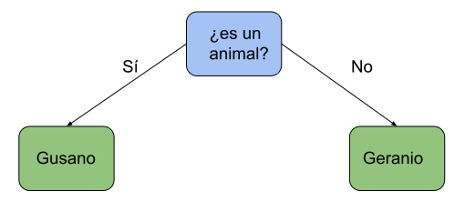

## Ejemplo: Juego de las 20 preguntas

Vamos a usar ahora una lista para almacenar una estructura compleja como es un árbol:

Este árbol nos va a permitir navegar entre los nodos que contendrán tanto las preguntas como las respuestas. Cada nodo también guarda referencias a la posición de otros dos:

* Al nodo al que ir si la respuesta es *Sí*.
* Nodo al que ir si la respuesta es *No*.

Los nodos que son preguntas tendrán valores válidos para moverse, los llamaremos nodos rama y actúan como bifurcación. Los nodos respuesta tiene -1 en los nodos a los que moverse, diremos que estos nodos son terminales o nodo hoja.

Iremos moviéndonos entre nodos hasta que lleguemos a un nodo terminal que será una respuesta y preguntaremos si es correcta.

Si no lo es, cambiaremos el nodo actual que pasa de ser terminal a ser bifurcación y añadiremos 2 nodos terminales que serán uno la respuesta actual y otro la nueva respuesta. El nodo actual ahora contendrá una nueva pregunta que apuntará a las dos posibles respuestas.

Este es el ejemplo de cambio cuando preguntamos si Gusano es la respuesta y no es el caso.

Este será el árbol después de añadir la nueva pregunta:

Este será el contenido de nuestra lista, donde vemos que los nodos *Respuesta* no conducen a ningún otro y por eso tienen los valores -1, mientras que los nodo *Pregunta* apuntan a otros dos.

    id	text    	Si	No
    0	es un animal	2	1
    1	geranio	        -1	-1
    2	tiene patas	    4	3
    3	gusano	        -1	-1
    4	perro	        -1	-1

Este programa lo vamos a ir ampliando a lo largo del curso, añadiendo funcionalidad y mejorando la forma en la que almacenamos la información.

[Ejemplo: Juego de las 20 preguntas v1](https://raw.githubusercontent.com/javacasm/CursoPython/master/codigo/7.2.1.Juego20Preguntas.py)

[Vídeo: Ejemplo de uso de Listas: Juego de las 20 Preguntas](https://drive.google.com/file/d/1yhesnSKvelVtGb7GkT7HO4QORgqivmfP/view?usp=sharing)

