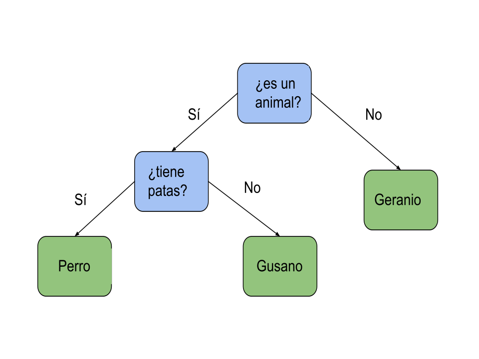
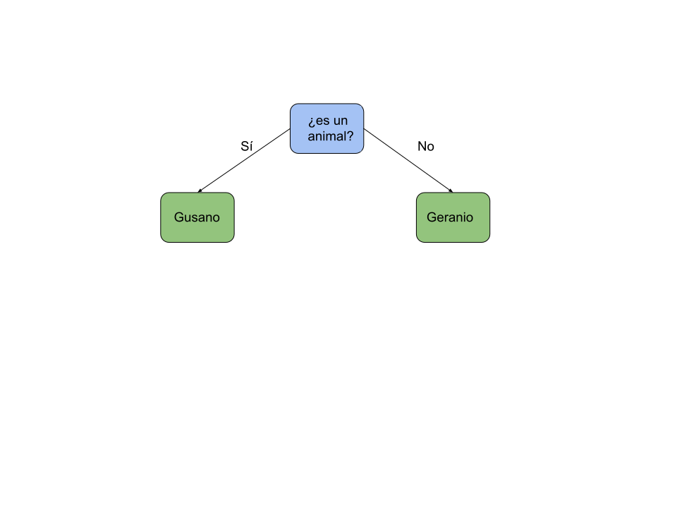

## Ejemplo: Juego de las 20 preguntas

Vamos a usar ahora una lista para almacenar una estructura compleja como es un árbol

Este árbol nos va a permitir navegar entre los nodos que contendrán tanto las preguntas como las repuestas. Cada nodo también guarda referencias a la posición de otros dos: al que ir si la respuesta es Si y al que ir si la respuesta es No.

Los nodos que son preguntas tendrán valores válidos para moverse, los llamaremos nodos rama y actúan como bifurcación. Los nodos respuesta tiene -1 en los nodos a los que moverse, diremos que estos nodos son terminales o nodo hoja.

Iremos moviéndonos entre nodos hasta que lleguemos a uno nodo terminal que será una respuesta y peguntaremos si es correcta.

Si no lo es cambiaremos el nodo actual que pasa de ser terminal a ser bifurcación y añadiremos 2 nodos terminales que serán uno la respuesta actual y otro la nueva respuesta. El nodo actual ahora contendrá una nueva pregunta que apuntará a las dos posibles respuesas

Este es el ejemplo de cambio cuando preguntamos si Gusano es la respuesta y no es el caso.

Este será el árbol después de añadir la nueva pregunta

    id	text    	Si	No
    0	es un animal	2	1
    1	geranio	        -1	-1
    2	tiene patas	 4	3
    3	gusano	        -1	-1
    4	perro	        -1	-1

Este programa lo vamos a ir ampliando a lo largo del curso, añadiéndole funcionalidad y mejorando la forma en la que almacenamos la información.

[Vídeo: Ejemplo de uso de Listas: Juego de las 20 Preguntas](https://youtu.be/bZTJ8jESr-U)

