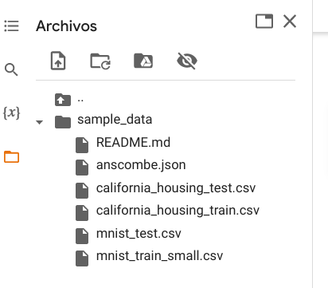
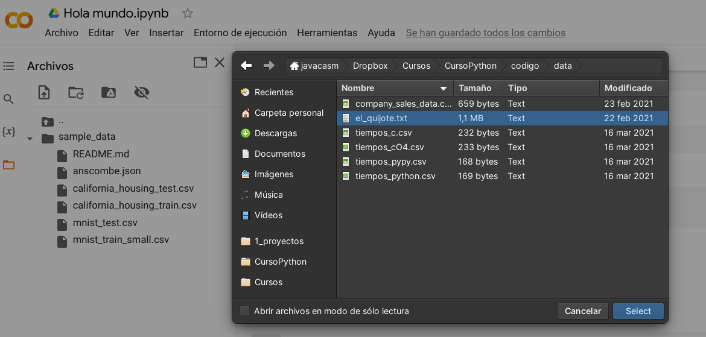
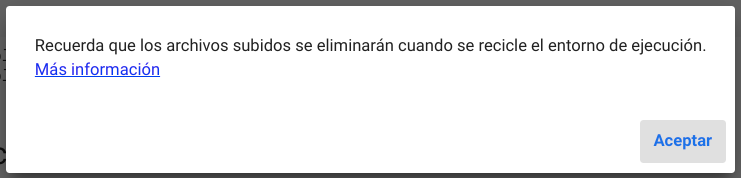
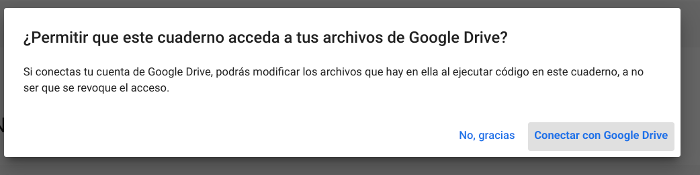
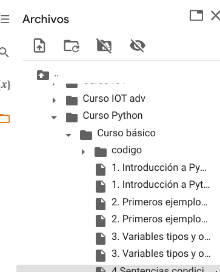
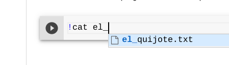
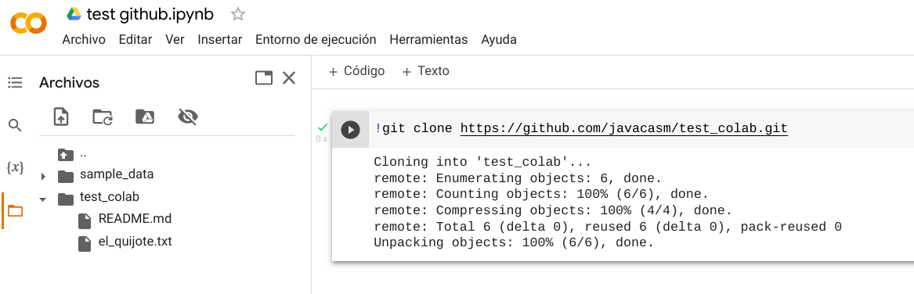

## Gestión de ficheros en Google Colab

Vamos a ver cómo podemos incorporar ficheros a nuestro proyecto. 

Tenemos un gestor de ficheros sin más que pulsar el icono de "Carpeta" de la barra lateral. Ahí podremos ver  las carpetas y ficheros. Por defecto incluye una carpeta de ejemplos (sample_data). Desde ahí podemos añadir, borrar, renombrar, ... nuestros ficheros

    

Podemos subir los ficheros desde nuestro ordenador, pulsando el primero icono

También podemos descargar cualquier fichero a nuestro ordenador.

Hay que recalcar que **los ficheros que añadimos a nuestra sesión se pierden cada vez que desconectamos del entorno de ejecución** o lo reciclamos.

Por esto vamos a ver formas de acceder a documentos en otros almacenamientos como Google Drive o Github.

### Conexión con Google Drive

Podemos conectar con Google Drive para acceder a los ficheros allí alojados. Al pulsar sobre el icono de "Google Drive" seleccionaremos nuestra cuenta y nos pedirá permiso para acceder a los ficheros:

Cuando conectamos con Google Drive nos aparecerá una carpeta "drive" entre nuestros ficheros y ahí se mostrarán los ficheros de Drive. Este paso puede tardar si tenemos muchos ficheros:

Tras conectar ("montar" en palabras técnicas) con Drive podemos desconectar (desmontar) pulsando en la opción correspondiente.

### Comandos directos

Podemos ejecutar comandos sobre el servidor al que estamos conectados como haríamos sobre cualquier máquina linux. Para ello anteponemos una "!" (admiración) al comando por ejemplo para trabajar con ficheros podemos usar:

* **!ls** para listar los ficheros del sistema

* **!cp** para copiar un fichero, por ejemplo "!cp el_quijote.txt libro1.txt"

* **!rm fichero.txt** para borrar "fichero.txt

* **!cat fichero.txt** para mostrar el contenido de "fichero.txt"

* **!ps -ef** nos muestra los procesos que se están ejecutando

### Conexión con Github

Podemos interaccionar con un repositorio github usando el comando **git clone** como lo haríamos en nuestro ordenador. 

* **!git clone repositorio.git**

