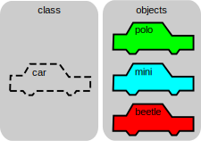
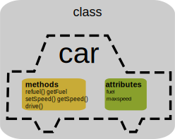

## Clases y Objetos

Cuando programamos intentamos modelar un contexto para resolver un problema concreto. Intentamos abstraernos para quedarnos con las propiedades esenciales y reflejar el funcionamiento de ese sistema.

Existen diferentes formas de hacer ese modelado, en este tema vamos a ver cómo hacerlo utilizando lo que se conoce como Programación Orientada a Objetos. En ella intentamos modelar nuestro sistema abstrayendo lo esencial a través **clases** que se representan lo general y  **objetos** que representan lo particular de cada uno.

Vamos a ver con un ejemplo, imaginando que estamos haciendo un programa para una gestoría: Podríamos pensar en modelar el concepto de documento:

* Tiene una *propiedades*, que en las clases llamaremos **atributos**, por ejemplo:
    * Quién aparece en el documento.
    * El texto del documento.
    * Las fechas relacionadas.
    * El fichero informático dónde se guarda.
* También se realizan unas *acciones* sobre el mismo, que en las clases llamaremos **métodos**:
    * Imprimir el documento.
    * Guardarlo en el ordenador.
    * Recuperarlo.
    * Firmar el documento.
    * Enviarlo a otras personas.
    * Archivarlo pasado un tiempo.

Pondremos todas las propiedades y el código para realizar estas acciones dentro de la definición de la clase. Las acciones tendrán la forma de funciones y las llamaremos **métodos**. De esta manera la clase se encarga y contiene todo lo necesario para su funcionamiento. A ésto lo llamamos **encapsulación** y va a hacer que nuestro código sea más mantenible y **reutilizable**.

Ahora pensemos en un documento más concreto, por ejemplo un contrato de alquiler. Además de las acciones y propiedades que hemos visto antes tendrá unas propiedades más concretas:

* Descripción del inmueble.
* Inventario de lo que contiene.
* Plazos de duración.

Y se podrán realizar algunas acciones nuevas:

* Pagos
* Depósito de la fianza

Vemos que el documento de alquiler **"hereda"** las propiedades del documento general y las amplía. Llamaremos a esta cualidad de las clases **herencia**.

Cuando nosotros ejecutemos el método *imprimir* de un documento éste se realizará independientemente del tipo de documento que sea y se encargará de hacer todo lo necesario seǵun su tipo. A esta propiedad, que simplifica bastante la vida del programador lo llamaremos **polimorfismo** y más adelante veremos ejemplos concretos.

Una **clase** sería la definición abstracta de un documento, que incluye sus propiedades y todo el código necesario para realizar las acciones necesarias. Todo esto se incluirá en el código de esta clase, por ejemplo la clase *Documento*.

Un **objeto** será la realización concreta de una clase, ya con sus valores concretos de fechas y nombres. Por ejemplo, un contrato de alquiler entre el Sr. Fernández y el Banco. La clase tiene las variables y estructuras necesarias para guardar los datos, el objeto tiene los valores de estos datos.

Podemos decir que la clase es el tipo y el objeto sería una instancia de esa clase/tipo.

En esta imagen podemos ver un ejemplo de lo que sería una clase *coche* y unos objetos *coches*.

### ¿Por qué usar objetos? 

Si ahora queremos hacer un nuevo programa para gestionar una notaría, cláramente podemos **reutilizar** el código de nuestras clases, lo que sería una gran ventaja. Sólo tendremos que cambiar la parte del código que une las clases y que utilizará el usuario.

Estas son algunas de ventajas de usar programación orientada a objetos: 

* Mejor estructura interna
* Más modular  
* Mayor facilidad de ampliación
     

El trabajar con clase y objeto nos va a permitir **estructurar mucho mejor nuestro código** haciéndolo mucho más comprensible y **reutilizable** 

### Resumiendo...

Una clase es un conjunto de funciones y de propiedades o variables que funciona como un todo. Todo el código está dentro de esa clase.

Llamaremos **métodos** a las funciones de una clase y **atributos** a las propiedades que contengan.

Al trabajar con clases podemos hacer que unas **hereden** de otras, de manera que podemos ir construyendo una **estructura más compleja**. 

Otra ventaja de trabajar con clases es lo que se conoce como **encapsulación**, es decir, que tanto las propiedades como el código, está en su interior de la clase. Podemos decir que su funcionalidad está autocontenida. Si queremos utilizar esa clase en otro programa sólo tenemos que definirla allí.

otra característica interesante es lo que se conoce como **polimorfismo** es decir podemos ver qué clases que derivan unas de otras tiene definen un comportamiento distinto para un mismo método. Cuando usemos esas clases, dependiendo del tipo que sean, se ejecutará el método correspondiente.

Queremos utilizar objetos porque de esa forma nuestro código es mucho más  **reutilizable** y estará mejor estructurado. El organizar el código de esta manera en proyectos muy complejos nos permite que sea más mantenible, incluso que podamos dividir las distintas partes entre distintos programadores cada uno utilizando unas clases u otras, es decir, nos da una mayor modularidad.

