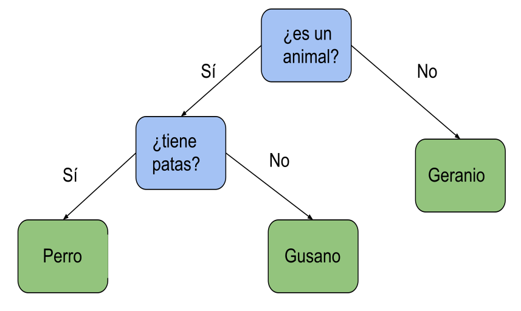

### Ejemplo: Juego de las 20 preguntas OO (Objected Oriented)

Vamos a estructura nuestro juego de las 20 preguntas utilizando clases y objetos para guardar y relacionar los datos.

[Código: Juego 20 Preguntas OO v1](https://github.com/javacasm/CursoPython/raw/master/codigo/9.3.2Juego20Preguntas.py)

Cada nodo guarda una pregunta o una respuesta. Si es una pregunta apunta a un nodo si la respuesta es Sí y a otro si es No. Los nodos que son respuestas no apuntan a ningún otro nodo

Internamente todos los nodos son iguales, pero  hemos representado en verde los nodos con respuestas y en azul los que son preguntas

[Vídeo: Adaptamos el Juego de las 20 Preguntas a POO (Programación Orientada a Objetos)](https://drive.google.com/file/d/1lT2BCmF4_KlAn055uDb1hOuwOcd7sXGp/view?usp=sharing)

El programa cada vez va siendo cada vez más complejo y el funcionamiento es exactamente el mismo. Si lo ejecutamos externamente, no se distingue que estamos utilizando un estilo de programación diferente. El funcionamiento es exactamente el mismo, pero internamente sí que lo hemos cambiado. Cuando se hace eso en programación se llama, se dice que se ha hecho una refactorización, que es como una reestructuración de la manera en la que hacemos las cosas, aunque el resultado sea el mismo.

Pero conseguimos de alguna forma ganar en esa mejor estructura interna que nos va a permitir ampliarlo. El objetivo es ampliar este programa para integrarlo en otros programas complejos y por eso sería interesante que lo tuviéramos. Cuanto más modular, mejor. Por eso lo primero que he hecho ha sido crear una clase que he llamado nodo y esa clase es la que nos ayuda a gestionar todo lo relacionado con la estructura del árbol en la que estamos trabajando. Ese nodo, pues, tiene unas propiedades como aquí, una propiedad texto, una propiedad, un enlace al *nodoSi* y otro al *nodoNo*, según sea una pregunta o no.

Por defecto lo ponemos a **None**, vacío, que es una palabra reservada que indica cuando una variable no tiene ningún valor. Los enlaces nos permiten referenciar directamente un objeto desde otro. Es decir, no nos van a obligar a buscar en una lista.

También hemos incluido un *idNodo* que nos facilita la ordenación de los nodos.

## Conversión a POO de 20 Preguntas v2

Vamos a convertir el resto del programa a POO, para ellos creamos un objeto *Juego20* que incluye toda la funcionalidad del mismo. Esto nos va a permitir usar este código en otros proyectos como por ejemplo un bot de Telegram.

Para implementarlo vamos a usar lo que se conoce como una *Máquina de Estados Finitos* ([Finite-state machine](https://en.wikipedia.org/wiki/Finite-state_machine)) que es una forma de representar el funcionamiento de un sistema. Para usar esta técnica tenemos que analizar nuestro sistema determinando los distintos estados por los que pasa y cómo se va moviendo entre los estados. Podemos representarlo gráficamente:

Una vez determinados los estados necesitamos crear una variable que guardará el estado actual y establecer en el código las transiciones entre los distintos estados.

[Código: Juego de las 20 preguntas OO v2](https://github.com/javacasm/CursoPython/raw/master/codigo/Preguntas20.py)

[Vídeo: Versión final con POO del Juego de las 20 Preguntas](https://drive.google.com/file/d/1dJ5bM9_h073WjPr5ByAc1ZSZzs84411s/view?usp=sharing)

