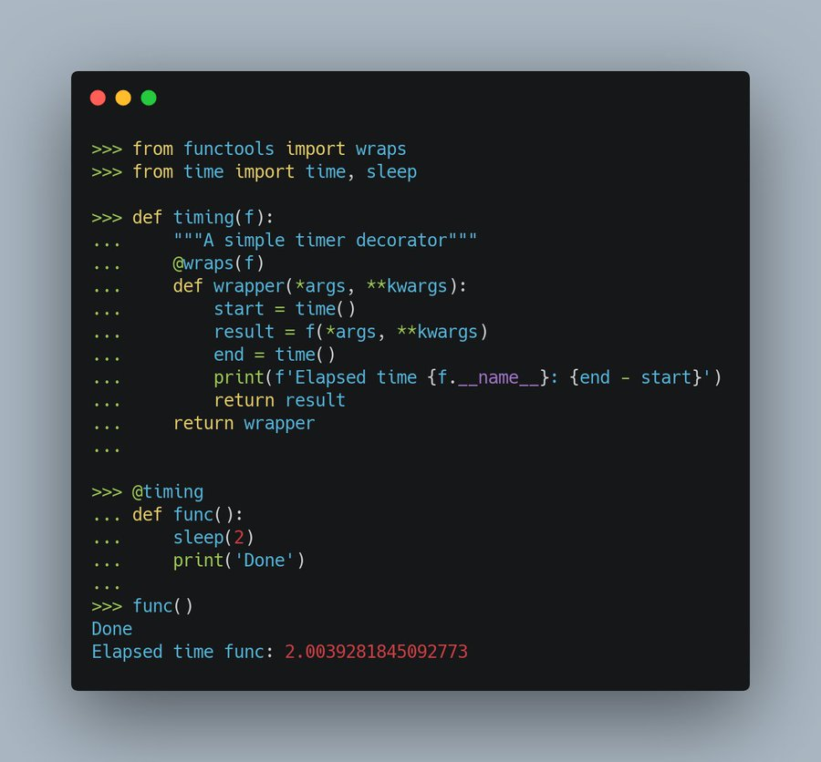

# Python avanzado

6. ficheros

Ficheros de texto vs ficheros binarios

Serializacion de objetos

json

Y. Numpy

Z. Panda

X. Base de datos

X. Threads

X. Ejecución de comandos del SO

__init__

__main__

## Entornos virtuales

Decorators 

## Rendimiento

Mejorar el rendimiento https://medium.com/swlh/python-can-be-faster-than-c-2372c627068

Compiladores de python